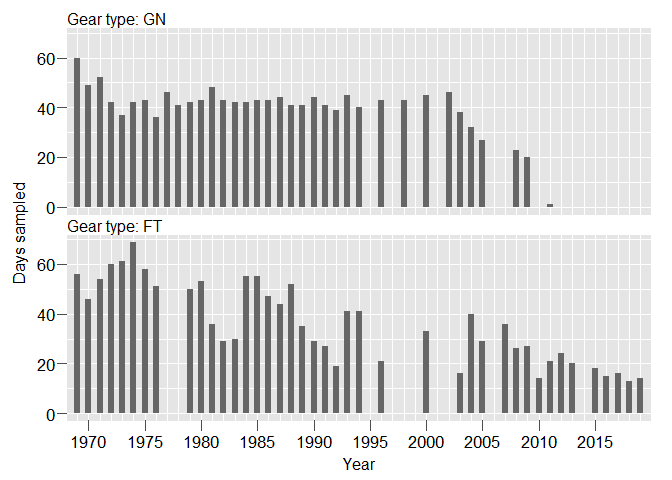
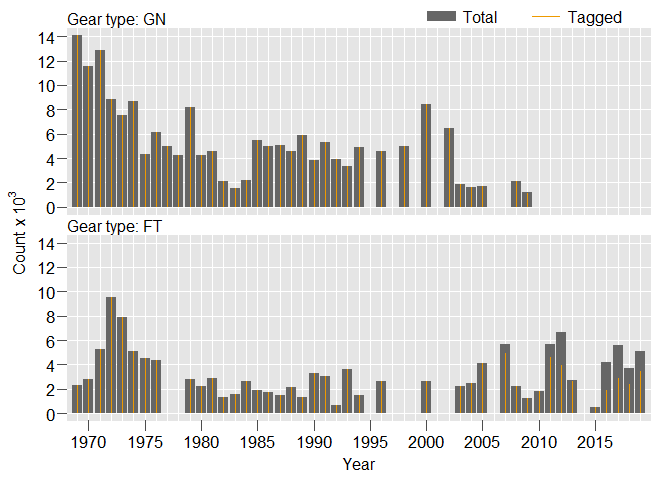

## Background

The California Department of Fish & Wildlife (CDFW) studies adult
Striped Bass using mark-recapture (tagging) methods. Since 1969, CDFW
has used gill nets and fyke traps to capture and then disc tag many
Striped Bass

… more to come

## Effort

Here we display — for now — some annual effort for fyke traps. Data
exist for other years and for gill net operations but are not readily
available in electronic form. In the future, we hope to make available
these data. Field headings are explained below.

  - Year: calendar year in which sampling was performed
  - Total: total hours fyke traps fished
  - Avg: daily average hours fyke traps fished
  - Var: daily variance hours fyke traps fished
  - Days: number of days fished
  - Fished: total (seasonal) number of fyke traps fished
  - Count: maximum daily number of fyke traps fished

| Year |     Total |    Avg |      Var | Days | Fished | Count |
| ---: | --------: | -----: | -------: | ---: | -----: | ----: |
| 1994 | 15172.083 | 48.319 | 1013.215 |   41 |    314 |    12 |
| 1996 |  5573.317 | 35.957 |  479.566 |   22 |    155 |    12 |
| 2000 |  5338.750 | 25.065 |   34.169 |   32 |    213 |     9 |
| 2003 |  2000.667 | 31.260 |  119.501 |   15 |     64 |     8 |
| 2004 |  7384.417 | 26.467 |   76.380 |   40 |    279 |    10 |
| 2005 |  4793.833 | 26.932 |  117.758 |   28 |    178 |    10 |
| 2007 |  8108.983 | 28.654 |  128.180 |   36 |    283 |     9 |
| 2008 |  6631.283 | 25.603 |   93.988 |   26 |    259 |    10 |
| 2009 |  6313.383 | 22.629 |   19.291 |   29 |    279 |    10 |
| 2010 |  2947.200 | 23.578 |    4.574 |   17 |    125 |     8 |
| 2011 |  4391.500 | 23.997 |    6.043 |   22 |    183 |    10 |
| 2012 |  5140.500 | 24.021 |    6.379 |   25 |    214 |     9 |
| 2013 |  6092.333 | 23.986 |    3.838 |   27 |    254 |    10 |
| 2015 |  2131.667 | 23.685 |    0.684 |   19 |     90 |     5 |
| 2016 |  2752.350 | 23.129 |   20.733 |   17 |    119 |     8 |
| 2017 |  2707.400 | 23.749 |    6.091 |   16 |    114 |     8 |
| 2018 |  2453.433 | 23.820 |    5.065 |   13 |    103 |     8 |
| 2019 |  3097.567 | 25.813 |   55.621 |   15 |    130 |     9 |

Here we display annual time series (since 1969) of days sampled (fished)
by gear type (GN = gill net; FT = fyke trap). We did not conduct
mark-recapture operations in the following years: 1995; 1997; 1999;
2001; 2006; 2014.

*Note*: We essentially stopped gill netting (GN) in 2009. We deployed
gill nets only one day in 2011.

<!-- -->

## Catch

Here we plot annual time series by gear type (GN = gill net, FT = fyke
trap) of total Striped Bass caught and Striped bass tagged (of those
caught).

<!-- *Note*: <need to talk about how earlier years electronic data not available for fish not tagged> -->

<!-- -->

-----

Contact [Jason DuBois](mailto:jason.dubois@wildlife.ca.gov)  
CDFW, SportFish Unit  
2019-10-17
