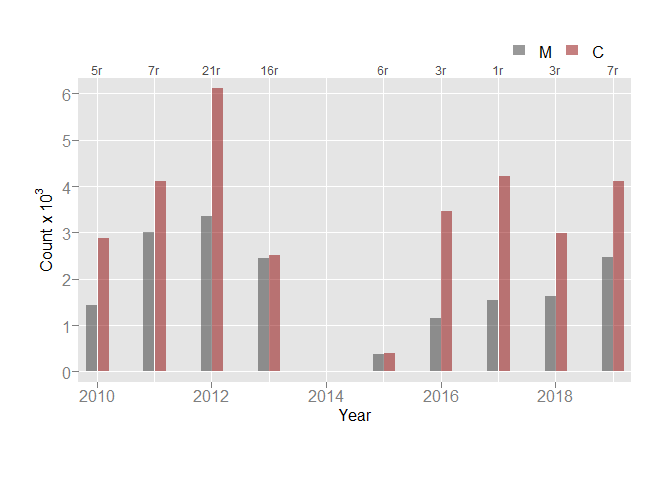
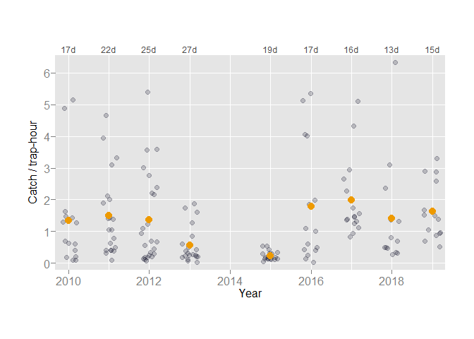

-----

-----

<!-- Tagging Data -->

<!-- (1) add field for length category (unk, sub, leg) -->

<!-- (2) expand dataframe on count field (could do #1 after this) -->

<!-- (3) Apply `AgeEach()` to expanded dataframe (use bin width = 1, but may -->

<!--     want to try binning very small & very large fish in bigger bins) -->

<!--     (a) should then have number that cannot be aged -->

<!--     (b) identify those that cannot be aged and possibly assign to age -->

<!--         based on closes bin (for example fish 100 assigned age-10, bu -->

<!--         fish 105 only one in bin & has no age could be age-10 too) -->

<!--     (c) complete table(is.na(Ages), `LenCat`,useNA = "ifany") to -->

<!--         help with 'b' -->

<!--     (d) the point is to age as many as possible -->

<!-- (4) somewhere in the process include only legal sized fish [maybe] -->

<!-- (5) table by age of fish tagged & all others (needed to get RAC) -->

<!-- (6) then get C for (M*C)/R -->

<!-- (7)  -->

<!-- Consider -->

<!-- (1) if not already, set sex to M, F, U OR 1, 2, 0 (need to include unknown) -->

<!-- (2) what to do with age (i.e, set as factor from 2 to max) -->

<!-- (3) what to do with length (weed out odd lengths e.g., 9) & do I -->

<!--     set as factor? -->

<!-- (5) After expanding & (perhaps) application of `AgeEach()` -->

<!--     a. then get lengths with no age -->

<!--     b. then get count no length & no age -->

<!--     c. then get count all legal sized (by tag action) -->

<!--     d. then get count recaps -->

<!--     e.  -->

<!--    big problem is how to programmatically assign age to fish when none -->

<!--     were aged at that length (kind of becomes a classification problem) -->

<!-- (5) split by year -->

<!-- (6)  -->

## Tagging

<!-- Tagging Data -->

<!-- (1) add field for length category (unk, sub, leg) -->

<!-- (2) expand dataframe on count field (could do #1 after this) -->

<!-- (3) Apply `AgeEach()` to expanded dataframe (use bin width = 1, but may -->

<!--     want to try binning very small & very large fish in bigger bins) -->

<!--     (a) should then have number that cannot be aged -->

<!--     (b) identify those that cannot be aged and possibly assign to age -->

<!--         based on closes bin (for example fish 100 assigned age-10, bu -->

<!--         fish 105 only one in bin & has no age could be age-10 too) -->

<!--     (c) complete table(is.na(Ages), `LenCat`,useNA = "ifany") to -->

<!--         help with 'b' -->

<!--     (d) the point is to age as many as possible -->

<!-- (4) somewhere in the process inlcude only legal sized fish [maybe] -->

<!-- (5) table by age of fish tagged & all others (needed to get RAC) -->

<!-- (6) then get C for (M*C)/R -->

<!-- (7)  -->

<!-- Consider -->

<!-- (1) if not already, set sex to M, F, U OR 1, 2, 0 (need to include unknown) -->

<!-- (2) what to do with age (i.e, set as factor from 2 to max) -->

<!-- (3) what to do with length (weed out odd lengths e.g., 9) & do I -->

<!--     set as factor? -->

<!-- (5) After expanding & (perhaps) application of `AgeEach()` -->

<!--     a. then get lengths with no age -->

<!--     b. then get count no length & no age -->

<!--     c. then get count all legal sized (by tag action) -->

<!--     d. then get count recaps -->

<!--     e.  -->

<!--  big problem is how to programmatically assign age to fish when none -->

<!--     were aged at that length (kind of becomes a classification problem) -->

<!-- (5) split by year -->

<!-- (6)  -->

<!-- 13-May-2020 -->

<!-- for now this gets us through age-composition for trap & gill net data only; still need to pursue creel census data;  -->

<!-- TODO (13-May-2020): -->

<!-- (1) use set.seed() for before sample() -->

<!-- (2) decide where to put variables (functions) within chunk al-key below -->

<!-- (3) be clear for recaptured fish which sex to use (right now I am using -->

<!--     sex assigned at release (tagging) but it appears they might have made -->

<!--     a judgment call here (see AGE_COM_2005_Tagging) -->

<!-- (4) define well the various steps used herein -->

### Fields & Factoring

To facilitate analytics, we added fields or converted to factor
(`base::factor()`) some existing fields in data set `StripedBass` (see
‘data/tagging/StripedBass.rds’). Conversion to factor ensure all
levels of some variable ‘x’ are present, for example when calling
`base::table()`.

#### Field *LenCat*

Short for length category, *LenCat* assigns either `sub`, `leg`, or
`unk` based on fork length. Sub-legal (`sub`) is any length less than 38
cm FL prior to 1982, or any length less than 42 cm FL 1982 forward.
Legal (`leg`) is any length not sub-legal, and unknown (`unk`) could not
be categorized (i.e., no length available). Adding this field
facilitates filtering (removing) sub-legal sized fish from the analysis.
See `sportfish::LengthGroup()` for more details.

#### Factoring Fields *Sex* & *TagAction*

The CDFW Striped Bass database stores `1` for male, `2` for female, and
blank for unknown (i.e., not recorded). We set field `Sex` to a factor
using levels `m` (male), `f` (female), and `u` (unknown).

The field `TagAction` (short for tagging action) was added \~2011 when
we upgraded from dBase to MS Access. The upgrade allowed for entry of
fish other than those that were disc tagged. So, `TagAction` provided a
means to distinguish between tagged fish, recaptured fish, and
non-tagged fish. Seven numerical (1-7) categories exist, with ‘1’
representing a disc tag.

The list of factor levels is provided below. Because in \~2010 we began
tagging sub-legal sized fish, here we added two levels for
distinguishing these fish from legal sized. The numeric database
equivalent is provided in parentheses. `Un` or unknown is likely a data
entry error (and should be corrected), as all fish should have a 1-7
labeling.

  - Ml (1) = marked legal sized fish
  - Ms (1) = marked sub-legal sized fish
  - S (4) = sub-legal sized, not marked
  - O (5) = over, no info recorded
  - D (6) = dead or floater
  - C (7) = creeled (beginning \~2010; fish measured & sexed but not
    tagged)
  - R2 (2) = recaptured fish returned to water with disc tag intact
  - R3 (3) = tag recovered not attached to fish (likely not many of
    these)
  - Un (-) = tagging action unknown

#### Fields *Sex* & *Age*

The abundance estimate algorithm requires recaptured fish (denoted with
*R*; i.e., a previously tagged fish). For these fish, the CDFW protocol
uses sex at release (tagging) and age as release age + number of years
at large. We create fields `Sex0` and `Age0` to house the desired sex
and age given fish status (i.e., tagged or recaptured). Doing so
preserves the original sex & age fields.

### Data Partitioning: *StripedBass* dataset

We generate abundance estimates for every release year (tagging year;
field `RelYear`). Using `sportfish::Split()`, we divide dataset
`StripedBass` on each release year, the results of which we give
variable name `catch`. `catch` has two fields: ‘RelYear’; ‘Data’ a list
column, where each element is the data (same fields as `StripedBass`)
for the appropriate release year.

#### Apportioning & Partitioning Sex

We stratify abundance estimates by age and by sex. To include the
maximum number of fish in such estimates, we apportion sex to fish
without such a field-assigned label using the known sex ratio.
`sportfish::ApportionSex()` calls `base::sample()`, setting parameter
`prob` to the proportion of males and females. This process assigns
either ‘m’ or ‘f’ to each fish without such a distinction and yields
only whole counts (i.e., no fractions of fish). Because `base::sample()`
results are random, it is necessary to call `base::set.seed()` (or
similar) for reproducibility.

`sportfish::ApportionSex()` returns the entire dataframe with the ‘Sex’
field adjusted accordingly. We use `catch[["Data"]]` and re-assign the
results back to said field.

We divide `catch[["Data"]]` by sex (using field `RelSex0`), assigning
the results to `catch$BySex`. `BySex` is a list within a list (Data –\>
Sex –\> Release Year; working inward to outward).

#### Age-Length Key

To most Striped Bass prior to 2010, an age was assigned by examining
scale samples collected from each fish. From 2010 onward, scale samples
were collected but to date have not been examined. (Though currently
some staff are working to age the backlog.) We developed an “quasi”
age-length key using available CDFW field sampling (tagging) data. We
used only fish with known lengths and ages and where fork length was ≥
30 centimeters. We did not bin length, and we did not stratify by sex.
The “quasi” label denotes we did not calculate proportions (as in a more
traditional age-length key). Rather we split (using `base::split()`)
ages by each fork length, assigning the results to variable `qalk`. We
discuss the application of `qalk` later in this report.

**Notes**

1)  Most Striped Bass in our dataset are ≥ 30 centimeters. Few exist
    that are smaller, but some are single digits - errors with data
    entry or migration (from dBase to Access) that require attention.

2)  We did not stratify the age-length key by sex mostly to maximize
    coverage at each length. In certain years, particularly recent ones,
    we collected way more males than females.

3)  `qalk` is a list with 90 elements (lengths). Use `names(qalk)` to
    see which lengths, and use `lapply(qalk, FUN = table)` to get age
    frequency for each length.

#### Assign Age: Tagging Data

The process we developed to assign an age to each non-aged fish is
admittedly involved. We use ‘Data’ in `catch[["BySex"]]`. Doing so
requires a nested `base::lapply()`.

1)  if number of rows ‘Data’ = 0, return NULL
2)  expand ‘Data’ on `Count` field (e.g., `lapply(Data, FUN = rep, times
    = Count)`)
3)  call `sportfish::AgeEach()`, supplying sequence min length to max
    length (by 1) to`lenBreaks`
4)  check for any ages NA
5)  if any NA, call `sportish::AgeAssign()`
    1)  requires call to `base::mapply()`, where `list(alk = qalk,
        setSeed = <some numeric>)` is supplied to `MoreArgs`
    2)  note setting seed as `sportish::AgeAssign()` calls
        `base::sample()`
    3)  note the use of `qalk`
6)  using results from \#5, assign age to any fish NA from step \#4
7)  check again for any ages NA
8)  if any, and if the data allow (i.e., enough samples) predict age
    from loess regression (use `stats::loess()`)
9)  using results from \#8, assign age to any fish NA from step \#7
10) any remain non-aged fish are assigned an age based on proportion of
    aged fish
11) create field `Aged` in dataframe and return the entire dataframe;
    output is ‘Data’ in `catch[["BySex"]]` with all fish aged (a message
    will display number NA, if any)

We assign results of steps above to `catch$AgeAssign`, a nested list.

### Age Composition

Age composition (AgeCom for short) is simply the final age frequency by
sex after non-aged and (or) non-sexed fish have been apportioned
accordingly. Find examples in `.xls` files located in directory
`U:\SportFish\asb\DATA\AGECOM` (example `AGECOM_<YYYY>_Tagging.xls`).
Here, we provide age frequency by tagging action to easily get marked
(tagged) fish and all fish.

We bin age as 2-7 and ≥ 8 (or ‘8p’ for 8 plus). We catch fewer older
fish, and older fish typically are more challenging to age. Thus the
reason for grouping. Two is the minimum age in our dataset, and here
also, we catch very few.

*Note*: for this process we do not include sub-legal sized fish.
However, since 2010 we have tagged such fish, and it might be best to
(1) include these fish or (2) separately estimate sub-legal abundance.
Neither have been explored to date (2020-07-15).

## Creel

<!--

for right now (13-May-2020) this file (_2age_com.Rmd) will contain creel census age-com, but may need to separate by creel type if file gets too big

-->

### Creel Census

The creel census began commensurate with catch, tag, and then release
CDFW field operations. Up until 2009 when the program was terminated,
CDFW staff queried anglers about their catch. Data collected provided
(1) additional catch and recaptures (the ‘C’ and ‘R’ in the Petersen
algorithm), (2) another gear type (hook-n-line) to mitigate for gill net
or fyke trap biases, and (3) a wider spatial coverage of the San
Francisco Estuary and Delta.

From 1969 through 1987, the Creel Census sampled <XXXXX>, thus called
Bay Creel. In 1988, River Creel was added providing coverage <XXXXXX>.
Bay Creel sampled 16-Jun through 15-Dec, and River Creel sampled 16-Dec
through 15-Jun.

#### Data

Creel census data are housed in the `data/tagging` directory in three
`.rds` files. These files are extracts from SQL Server database `BDASB`
and are explained below. Information from all three are used to estimate
abundance.

  - *CreelCensus*: trip information (i.e., date, hours fished; anglers;
    species; catch)
  - *CCAge*: fish specific length, sex, age, and tag number (if any or
    all available)
  - *CCLenSex*: fish specific length & sex; tag number if available

### Data Preparation

We need to distinguish the dataset as either ‘bay’ or ‘river’
(abbreviated ‘rvr’ for convenience). Further, we need to distinguish
creel year from sampling year, as river creel samples over the calendar
year. December river creel sampling is grouped into the next calendar
year (e.g., 1987 sampling is creel year 1988).

We use `sportfish::CreelType()` to add three new fields to `CreelCensus`
and `CCAge`: ‘CYear’ (or creel year), Month (month in which creel
occurred), & Type (either ‘bay’ or ‘rvr’).

The protocol requires a count of Striped Bass count measured and (or)
sexed. For convenience, we add this count as field `LenSexCount` to the
`CreelCensus` dataset. We obtain count by getting the frequency of field
`DetailID` in dataset `CCLenSex`. The relation is one–\>many
(`CreelCensus` to `CCLenSex`) on `DetailID`. So, tabulation of each
`DetailID` in `CCLenSex` will give total measured for each record in
`CreelCensus`.

Because of the way creel data was uploaded from flat-files to MS Access
(\~2011), there exist some duplicate records (less fields `DetailID` &
\# `LenSexCount`) in `CreelCensus`. Including these duplicate records
will inflate catch when summing the `Catch` field. We identify such
duplicate records in `CreelCensus` for later filtering.

To facilitate record filtering (i.e., duplicate removal), using
`sportfish::Split()` we separate `CreelCensus` by creel year, month,
type, main ID, and catch. We store results in variable `cc_split`. Older
creel flat-files stored up to \~12 lengths in one row before continuing
on the next line (row). In a somewhat convoluted method, we identify
these records and filter them from the process. See `base::vapply()`
loop to generate `cc_split$CatchSum` in file `_2age_com.Rmd`.

We sum `CatchSum` by creel year, month, and type for the final catch
tally. Variable `census_count` holds the results of `stats::aggregate()`
performing such process.

### Fields & Factoring

To facilitate analytics, we added fields or converted to factor
(`base::factor()`) some existing fields in data set `CCAge`. Conversion
to factor ensure all levels of some variable ‘x’ appear, for example
when calling `base::table()`.

For data cleaning, we set to `NA` non-ages (0 & 1) and non-lengths (0).
We set `Sex` field to factor using levels ‘m’ (male), ‘f’ (female), and
‘u’ (unknown).

We add fields `Year` (calendar year) and `LenCat` (length category) to
further facilitate analytics. We add length category using
`sportfish::LengthGroup()`.

### Data Partitioning: *CCAge* dataset

We split `CCAge` by creel year to facilitate getting catch by age
annually (and by creel type). We use `sportfish::Split()`, assigning
results to variable `creel`.

We stratify abundance estimates by age and by sex. To include the
maximum number of fish in such estimates, we apportion sex to fish
without such a field-assigned label using the known sex ratio.
`sportfish::ApportionSex()` calls `base::sample()`, setting parameter
`prob` to the proportion of males and females. This process assigns
either ‘m’ or ‘f’ to each fish without such a distinction and yields
only whole counts (i.e., no fractions of fish). Because `base::sample()`
results are random, it is necessary to call `base::set.seed()` (or
similar) for reproducibility.

`sportfish::ApportionSex()` returns the entire dataframe with the ‘Sex’
field adjusted accordingly. We use `creel[["Data"]]` and re-assign the
results back to said field.

We divide `creel[["Data"]]` by sex (using field `Sex`), assigning the
results to `catch$BySex`. `BySex` is a list within a list (Data –\> Sex
–\> Creel Year; working inward to outward).

### Growth Rate: Bay Creel

Each Bay Creel season began shortly after tagging had ended. Previous
biologists developed a method to weed from creel data fish that were not
legal sized during tagging. This method created a crude age-3 growth
rate using available mean monthly fork length data July-November. The
growth rate was cumulatively added to minimum legal size (e.g., 42 cm
fork length) to yield a monthly cutoff length. Any fish less than such
length would not be included in analytics. June and December were not
included as these were “half” months.

Here, we developed a daily growth rate using similar methodology. We
used all available bay creel data (June through December) obtaining the
slope (growth rate) from least squares regression (`stats::lm()`) on
fork length as a function of date.

We developed the monthly cutoff using daily growth rate and the number
of days in each month, where June and December each had 15 days to mark
the start and end of the Bay Creel season. Where the daily growth rate
was ≤ 0, we used the overall median growth rate.

<!-- discuss growth rate not always linear and not always positive due to lack(?) of data -->

### Assign Age: Creel Data

The process we developed to assign an age to each non-aged fish is
admittedly involved. We use ‘Data’ in `creel[["BySex"]]`. Doing so
requires a nested `base::lapply()` and does not consider creel type.

1)  call `sportfish::AgeEach()`, supplying sequence min length to max
    length (by 1) to`lenBreaks`
2)  check for any ages NA
3)  if any NA, call `sportish::AgeAssign()`
    1)  requires call to `base::mapply()`, where `list(alk = qalk,
        setSeed = <some numeric>)` is supplied to `MoreArgs`
    2)  note setting seed as `sportish::AgeAssign()` calls
        `base::sample()`
    3)  note the use of `qalk`
4)  using results from \#3, assign age to any fish NA from step \#2
5)  check again for any ages NA
6)  any remain non-aged fish are assigned an age based on proportion of
    aged fish
7)  create field `Aged` in dataframe and return the entire dataframe;
    output is ‘Data’ in `creel[["BySex"]]` with all fish aged (a message
    will display number NA, if any)

We assign results of steps above back to `creel$BySex`, a nested list.

### Relative Age Composition: Creel

Per protocol, we developed a relative age composition (RAC) by creel
type (bay & river). Here we filtered (removed) any fish categorized as
sub-legal (`sub`). For Bay Creel data, we further filtered data on the
monthly length cutoff calculated in previous sections. Output for both
creel types is age frequency by month and number measured by month. Bay
Creel output includes frequency measured meeting cutoff requirement.

*Note*: per protocol, River Creel ages from Dec-Mar are increased by 1.
Tagging does not begin until April, so it is assumed (likely <VERIFY>)
fish collected Dec-Mar are from previous year.

To apportion total catch by sex, we needed the monthly sex ratio for bay
creel and river creel. For this, we used data in `creel[["RAC"]]`. For
bay creel, we used the monthly count of fish at or above the cutoff. For
river creel, we used all measured fish. Examples of each are shown
below.

    ## Bay Creel - 2002

    ##            m         f
    ## 6  0.4424242 0.5575758
    ## 7  0.4702194 0.5297806
    ## 8  0.4583333 0.5416667
    ## 9  0.4534884 0.5465116
    ## 10 0.4613260 0.5386740
    ## 11 0.3917910 0.6082090
    ## 12 0.3653846 0.6346154

    ## 
    ## River Creel - 2002

    ##            m         f
    ## 12 0.5250000 0.4750000
    ## 1  0.3303571 0.6696429
    ## 2  0.4329897 0.5670103
    ## 3  0.7010870 0.2989130
    ## 4  0.6209150 0.3790850
    ## 5  0.6261981 0.3738019
    ## 6  0.3901345 0.6098655

For Bay Creel, to apportion total catch we also need the monthly ratio
of measured (cutoff) to measured (all). Per protocol, this ratio was
calculated irrespective of sex. So, we employed `base::Reduce()` and `+`
to “collapse” the list of males and females. From outward inward, nested
lists proceed as follows: measured –\> creel type –\> sex –\> creel year
–\> `creel[["RAC"]]`.

Next, we needed monthly age frequency (proportion) by creel type.
Simply, we called `base::prop.table(x, margin = 2)`, where `x` = table
age x month. *Note*: `prop.table()` column sums should all equal 1.

### Census Catch Apportioned

Here, we apportioned census catch (found in variable `census_count`) by
sex, separately by creel type. This is the final step prior to getting
age compostion.

#### River Creel

To avoid fractions, the process (here, not protocol) assigns the “left
over” 1 to male if the proportion of males is greater, otherwise female.
The output is a frequency table month x sex (m, f).

#### Bay Creel

Though the output is identical (frequency table month x sex), the
process to get there using Bay Creel data required slight modifications
to include length cutoff (i.e., proportion measured all vs legal sized
by month). Below we detailed the steps.

1)  match records by month for proportion (measured all to cutoff) to
    `census_count`
2)  multiply number censused (catch) by monthly proportion
3)  get whole count & residual (rounded for simplicity)
4)  sample months based on residual (uses `base::sample()`)
5)  add step 4 with whole count in step 3
6)  by month and using monthly sex ratio, `base::sample()` either ‘m’ or
    ‘f’ based on count in step 5
7)  `base::factor()` step 6 then call `base::table()` on factored
    results

### Age Composition: Creel

Documented here are the final steps to get ‘C’ from creel data. This
process uses proportion age x month and apportioned (‘m’ or ‘f’) census
catch.

#### Bay Creel

Per month and by sex, we multiply census catch by proportion at age.
This yields fractions of fish, so using `base::sample()` we randomly
selected ages based on sum of residuals and proportions at age. The
output is the whole number frequency at age plus residuals (of random
sampling).

To get ‘C’, we simply summed the rows (ages) for ages 3-7, and then
summed all ages ≥ 8. The results for each creel year is a 6 x 2 matrix
(ages x sex).

#### River Creel

For River Creel, we used the same process as Bay Creel. The output is
the whole number frequency at age plus residuals (of random sampling).

To get ‘C’, we simply summed the rows (ages) for ages 3-7, and then
summed all ages ≥ 8. The results for each creel year is a 6 x 2 matrix
(ages x sex). For River Creel, we needed an extra step to compensate for
“missing” ages. The problem only happened once in the dataset (creel
year 2009 for females). Essentially, if the output is not length = 6,
then we checked which age was missing, and then added in its place a
zero (0).

### Recaptures: Creel

Recaptures provide the ‘R’ for the abundance (*N*) algorithm. We used
tagging data after assigning ages (i.e., `catch[["AgeAssign"]]`), as
this process requires using age assigned at release. We match recapture
data to the appropriate tagging (release) data (using tag number; see
variable `new_data`). If a match, we extract year, sex, and age release
data. The result is an array 6 x 1+ x 2 (ages x recapture year x sex)
for each release year. The ‘1+’ denotes at least one or more recapture
years.

## Abundance

<!--

file contains all M, C, & R data for N = (M * C) / R, where N is abundance

Steps to Final N:

y = estimate year
i = 1-4 (annual updates), with y0 the initial year

M = marks (tags) from y0
C = catch (total caught)
R = recaptured tags

bc = bay creel
rc = river creel
tg = tagging

upd = update

y0  est0: M(y0) | Cbc(y0) | Rbc(y0)
y+i upd1: M(y0) | Cbc(y0) + Crc(y+i) | Rbc(y0) + Rrc(y+i)
    upd2: M(y0) | Cbc(y0) + Crc(y+i) + Ctg(y+i) | Rbc(y0) + Rrc(y+i) + Rtg(y+i)
    upd3: M(y0) | Cbc(y0) + Crc(y+i) + Ctg(y+i) + Cbc(y+i) | Rbc(y0) + Rrc(y+i) + Rtg(y+i) + Rbc(y+i)
    
note: with upd1 in y+i=1 Cbc(y0) & Rbc(y0) values are deleted for age-3 fish only (due to growth rate variability)

-->

### Road Map (for lack of better title)

Historically, Bay Creel data provided the first abundance estimate for
tagging year `y0`. Each year after `y0` for up to four years (`y0` + 4),
estimates were updated with river creel, tagging, and bay creel data (in
that order). Estimates were considered final in year `y0` + 4 after the
final bay creel update.

Estimates are age and sex stratified, with ages 8 and up being grouped
as 8 plus (denoted `8p`). Typically, fewer older fish are caught, and
older fish are more challenging to age, thus the reasons for grouping.
We calculate annual estimates for adult Striped Bass (ages 3-8p) and
total (the sum of ages 3-8p). We use the equations below for the
estimate and variance (Ricker 1975).

  
}{\\sum_{i=0}^{4}R_t+1}")  

  
=\\frac{\\hat{N_y}^2\\times(C-R)}{(C+1)\\times(R+2)}")  

  
=\\hat{N_y}\\pm 1.96\\times\\sqrt{Var(\\hat{N_y})}")  

The number of marks (or tags; *M*) from year `y0` is not affected with
each update. However, *C* (catch) and *R* (recaptures) are
cumulative\[^1\] with each update. Updates are age specific, as depicted
in the matrix below. The double-x (xx) denotes which ages are updated
(i.e., cumulative). For example, after `y0` ages 7 and 8p are not
updated (i.e., `y0` estimates for these age groups are final). The
matrix is strictly applied even in the absence of `y0 + 1|2|3|4` (e.g.,
no tagging in 2006 so an update for `y0` 2005 using 2007 tagging data
would follow the `y0 + 2` column).

| Age | y0 | y0 + 1 | y0 + 2 | y0 + 3 | y0 + 4 |
| --- | -- | ------ | ------ | ------ | ------ |
| 3   | xx | xx     | xx     | xx     | xx     |
| 4   | xx | xx     | xx     | xx     |        |
| 5   | xx | xx     | xx     |        |        |
| 6   | xx | xx     |        |        |        |
| 7   | xx |        |        |        |        |
| 8p  | xx |        |        |        |        |

To further demonstrate the estimate-update process, we created the
diagram below. *Note*: `upd3` carries over to the next update year
(i.e., cumulative).

  - y0
      - est0: M(y) & Cbc(y) & Rbc(y)  
  - y+*i*
      - upd1: M(y) & Cbc(y) + Crc(y+*i*) & Rbc(y) + Rrc(y+*i*)  
      - upd2: M(y) & Cbc(y) + Crc(y+*i*) + Ctg(y+*i*) & Rbc(y) +
        Rrc(y+*i*) + Rtg(y+*i*)  
      - upd3: M(y) & Cbc(y) + Crc(y+*i*) + Ctg(y+*i*) + Cbc(y+*i*) &
        Rbc(y) + Rrc(y+*i*) + Rtg(y+*i*) + Rbc(y+*i*)

where…  
y | y0 = estimate year  
*i* = 1-4 (annual updates)

M = marks (tags) from `y`  
C = catch (total caught)  
R = recaptured tags

bc = bay creel  
rc = river creel  
tg = tagging

est = estimate  
upd = update

\[1:\] first update excepted: age-3 *C* and *R* values from Bay Creel
estimate `y` are replaced with River Creel update `y + 1` due to
variations in growth

Around 2010, CDFW for various reasons developed a backlog of un-aged
scale samples and discontinued the Creel Census. As discussed
previously, we applied an age-length key to “age-less” sampling years.
No Census data meant only one update (tagging) per year and no initial
estimate from Bay Creel data.

### Components (*M* | *C* | *R*)

For ease of calculating annual estimates, the next steps configure data
to a matrix format of age (3-8p) x year, where year is five columns `y0`
through `y0 + 4`. We do this for each release year in variable `catch`.

#### Creel *C*

Here we add field `BayC` to variable (dataframe) `catch`. `BayC` houses
catch data for `y0` and `y0 + 1|2|3|4`. When no data are available
(e.g., no tagging for year `y0`), NAs are returned. Otherwise, *C* data
are returned for the appropriate ages given the update year. An example
for year 2002 is shown below (males). Note the zeroes (0) for ages &
years where update is not warranted.

    ##    2002 2003 2004 2005 2006
    ## 3   284  102  117   94    6
    ## 4   225   99   85   41    0
    ## 5   355  114   43    0    0
    ## 6   153   65    0    0    0
    ## 7    37    0    0    0    0
    ## 8p   29    0    0    0    0

Process is identical to bay creel *C*, except here we add field `RvrC`.
An example for `y0` 2003 is provided below (females).

    ##    2003 2004 2005 2006 2007
    ## 3    58   45  135   44   13
    ## 4   187   34   62   14    0
    ## 5   203   25   14    0    0
    ## 6   245   17    0    0    0
    ## 7    94    0    0    0    0
    ## 8p   33    0    0    0    0

#### Creel *R*

Like Creel *C*, we need creel recaptures in the appropriate format
(i.e., age x year). Here we add to `catch` fields `BayR` and `RvrR`
using data in `creel[["Recaps"]]` to get appropriate *R*. The process is
the same for both creel types. From inward to outward,
`creel[["Recaps"]]` is nested as array (age, year, sex) –\> creel type
(bay | river) –\> estimate year (`y0`). ‘year’ in array is release year
making `y0` also the recapture year. An example using river creel 2003,
females is displayed below. *Note*: `BayR` and `RvrR` select only ages
3-8p.

Sampling year in this example is 2003. The one age-5 from 2002 was
tagged in 2002 recaptured in 2003. Years 1998, 2000, & 2003 are present
in the table — despite all 0s — because male fish were recaptured in
these years.

    ##     Year
    ## Aged 1998 2000 2002 2003
    ##   2     0    0    0    0
    ##   3     0    0    0    0
    ##   4     0    0    0    0
    ##   5     0    0    1    0
    ##   6     0    0    0    0
    ##   7     0    0    0    0
    ##   8p    0    0    0    0

#### Tagging *C*

We add `TagC` to variable (dataframe) `catch`. This step uses
`catch[["AgeCom]]`, each element of which is a table (age x tagging
action). *C* is simply the table row sums (using `base::rowSums()`) less
any fish deemed sub-legal (column `S`). The desired age or ages are
selected depending upon the update year. *C* is set to 0 for non-updated
ages.

Because tagging data has been used as “update” and not initial estimate
(like bay creel), `TagC` does not get *C* for `y0`, only `y0 + 1|2|3|4`.
We get `y0` *C* in `InSeasonTagC` (see `catch[["InSeasonTagC"]]`). An
example of `TagC` (2002) for both males & females is shown below. We did
not tag Striped Bass in 2006.

    ## $m
    ##    2003 2004 2005
    ## 3  1417  811  310
    ## 4   580  232  155
    ## 5   718  257    0
    ## 6   166    0    0
    ## 7     0    0    0
    ## 8p    0    0    0
    ## 
    ## $f
    ##    2003 2004 2005
    ## 3   101  109   47
    ## 4   102   57   16
    ## 5   110   43    0
    ## 6    36    0    0
    ## 7     0    0    0
    ## 8p    0    0    0

#### Tagging *R*

The protocol has been to use release (tagging) sex for recaptured (*R*)
sex and release year age + number years post release for recaptured age
(i.e., not the age derived from the recaptured fish scale sample). To
comply with the protocol, we created a dataframe of only tag releases
with the desired fields (e.g., sex; age; tag number; see variable
`tag_release`). We then used this dataframe to match (via tag number)
all electronically available records of recaptured fish.

To variable (dataframe) `catch`, we added field `TagR`. We looped
through each release year and sex to get recaptured fish (i.e., tagging
action 2) from `catch[["AgeAssign"]]`. Matching tag number on tag
number, we retrieved the desired data from `tag_release`, and then
produced an age frequency using `base::table()`, the results in `TagR`.
An example is displayed below (males, release year 2002). The years
(columns) are recapture years for release year 2002. For 2006, the 0s
are merely a placeholder, as we did not tag Striped Bass that year.

    ##    2002 2003 2004 2005 2006
    ## 3     0    8    2    1    0
    ## 4     0   15    6    3    0
    ## 5     0    7    3    0    0
    ## 6     0    1    0    0    0
    ## 7     0    0    0    0    0
    ## 8p    0    0    0    0    0

#### Tagging *M*

From `catch[["AgeCom"]]`, we simply retrive `Ml`, or mark (tag) count
for legal-sized fish. We add field `TagM` to `catch` for convenience
with the following steps. An example below displays marks by age for
2019 release year females.

    ##     Ml
    ## 3   49
    ## 4  113
    ## 5   64
    ## 6   26
    ## 7    4
    ## 8p  13

### Cumulative *C* & *R*

Both *C* and *R* are cumulative starting with the initial estimate in
`y0` through the final update in `y0 + 4`. Here we assemble the
appropriate *C* and *R* for each estimate year (i.e.,
`catch["RelYear"]`). From `catch` we use variables `BayC`, `RvrC`,
`TagC`, `BayR`, `RvrR`, and `TagR`, collectively bringing *C*s & *R*s
into list columns `CumC` and `CumR`. The list column is configure as
(inward to outward) 5-element list (`y0` through `y0 + 4`) –\> 2-element
list (male & female) –\> 45-element list (each release year; will change
with further release years). See example below (*C*, male, 2002 release
year).

*Notes*:

1)  `U` stands for update (e.g., `URvr` update using River Creel)
2)  In the absence of Bay Creel data, we used `InSeasonTagC` so at least
    some *C* would be available for an estimate.
3)  We have not employed within season recaptures, as per protocol.
    (VERIFY)

<!-- end list -->

    ## $`2002`
    ##   3   4   5   6   7  8p 
    ## 284 225 355 153  37  29 
    ## 
    ## $`2003`
    ##    URvr UTag UBay
    ## 3   493 1910 2012
    ## 4   454 1034 1133
    ## 5   525 1243 1357
    ## 6   202  368  433
    ## 7    37   37   37
    ## 8p   29   29   29
    ## 
    ## $`2004`
    ##    URvr UTag UBay
    ## 3  2050 2861 2978
    ## 4  1148 1380 1465
    ## 5  1372 1629 1672
    ## 6   433  433  433
    ## 7    37   37   37
    ## 8p   29   29   29
    ## 
    ## $`2005`
    ##    URvr UTag UBay
    ## 3  3011 3321 3415
    ## 4  1481 1636 1677
    ## 5  1672 1672 1672
    ## 6   433  433  433
    ## 7    37   37   37
    ## 8p   29   29   29
    ## 
    ## $`2006`
    ##    URvr UTag UBay
    ## 3  3420 3420 3426
    ## 4  1677 1677 1677
    ## 5  1672 1672 1672
    ## 6   433  433  433
    ## 7    37   37   37
    ## 8p   29   29   29

### Abundance

Here we combine *C* and *R* with *M* (marked) to calculate abundance and
abundance variance. We supply these variables to
`sportfish::PetersenEst()` to get cumulative age & sex stratified
estimates. For convenience of plotting, we create variables `AbunTot`
and `AbunLowUpBounds` within dataframe `catch`.

Historically, we know 95% confidence limits for (N) can be very broad.
So much so the lower end becomes negative, the “impossible” value an
artifact of the variance equation. This is especially true for females,
where catch & recapture numbers tend to be low. Below we display annual
(2010-2019) confidence limits for male and female Striped Bass. The
point estimate lies somewhere in the middle, but the true estimate is
anywhere within the bars. *Note*: some lower bounds are negative and
calculating confidence intervals using another method (e.g., log-linear)
might be advised.

<!-- -->

### Abundance: Fyke Traps

Since 2010, sampling has been significantly curtailed. We dropped gill
netting (except for one day in 2011), dropped the Creel Census, and
developed a backlog of un-aged scales due to limited personnel. In 2014,
there was no sampling of any kind. Further, fyke trap sampling rarely
has spanned the entirety of Apr-May, the historic period. Below, we
state reasons why estimates in the previous section lack rigor, and then
provide estimates (with notes) from 2010-2013, 2015-2019 using only fyke
trap data.

1)  by original design, Bay Creel data provided the initial estimate
2)  annual updates (4 total) followed using River Creel, Tagging, and
    then Bay Creel datasets
3)  gill netting & creel census data not only augmented *C* and *R* data
    (gill netting *M* as well) but these gear types provided samples
    from a broader demographic range (i.e., possibly larger \[older\]
    fish with perhaps a more balanced sex ratio)
4)  creel census provided year-round sampling with a larger (than traps
    or nets) geographic footprint
5)  ages (from scale sample analysis) provided stratification (ages 3-8
    plus) and — by original design — a means to included or not include
    age-3 fish given update type (river, tag, bay), update number (1, 2,
    3, or 4), and sex (male or female).
6)  given limited annual sampling within only a small reach of the
    spawning grounds, it is likely data from the previous decade depict
    more about the (spawning) run strength and less about absolute
    system-wide abundance

#### Fyke Trap *M* | *C* | *r*

Here we estimate abundance 2010-2013, 2015-2019 using only fyke data,
irrespective of age and sex. Further recaptures (*r*) consider only
previous seasons and not recaptures based on the release-year estimate
(thus lowercase *r* and not *R*). To our `catch` dataframe, we assigned
variable `FykeMCR` to contain such data. For ease of display, we created
variable `FykeEstCI` to house confidence limits, , and *r*.

For convenience, we display annual number marked (*M*; aka tagged),
caught (*C*), and recaptured (*r*). We did not tag Striped Bass in 2014.

*Notes*: (1) paltry number of fish caught and (or) tagged in 2015 (2)
annually recaptures (*r*) are highly variable (3) large differences
between tagged and caught due to many fish per day given ability to
process (tag) quickly; on those days we “creeled” fish (i.e., measured &
sexed but not tagged)

<!-- -->

#### Fyke Trap Abundance

Here we display abundance 95% confidence intervals from 2010-2013,
2015-2019 using only fyke trap data. The top x-axis displays the number
fish tagged in previous seasons recaptured in the year on the bottom
x-axis.

*notes*: (1) most confidence intervals are broad (extremely so for 2017)
(2) it is highly unlikely the population crashed in 2015; rather this
likely demonstrates few fish spawned that year (3) utilizing within
season recaptures might improve confidence intervals (but we have not
explored this option yet)

<!-- -->

## CPUE

<!--
TODO (14-May-2020):
(1) split by year
(2) count legal sized by gear type
(3) days or months fished by gear
(4) # traps or net sets --- not totally accurate for StripedBass dataset as   
    DriftTrap only represents # traps where fisher were caught, not # traps   
    fished
(5) attempt to standardize as in Kohlhorst et al. 1992 (36 trap days, etc.)

-->

### Striped Bass Index

Kohlhorst et al. (1992) developed an index using fyke trap and gill net
effort and catch data. Effort was standardized to 36 trap-months (fykes)
and to 4 boat-months (gill nets). Few details are available describing
such methods. The best we can glean from hardcopy notes (Appendix 73 in
Sportfish protocol) and other references (Stevens et al. 1985) suggests
multiplying a correction factor (for effort) by catch yielded the index.

#### Correction Factor

Twelve fyke traps and two gill netting boats set the gear standard.
Ninety-one (91) days for fykes and 44 days for boats set the duration
standard. Fyke trap standardized days assumes 15 (Mar), 30 (Apr), 31
(May), and 15 (Jun) yielding 91d. It is not clear how team Kohlhorst
arrived at 44d, but we can assume 22 days each in Mar & Apr.

The correction factor (*CF*) is the ratio of standardized (gear \* days)
to actual (gear \* days). Below we show the standardized values for fyke
& gill net. The actual is derived by the same method given how many days
fished multiplied by number of gear (e.g., fykes: 12 traps each fished
70d & 6 traps each fished 1d –\> (70 \* 12) + (1 \* 6) = 846)

Standardized   

CF (using fyke example)  

Stevens et al. (1985) defines trap-month as 30d 24-hour fishing fykes
and boat-month as 20d 8-hour fishing gill nets. The use of ‘month’ and
‘day’ and the absence of gear quantity (e.g., 12 traps) is somewhat
confusing (at least to me, anyway). I arrive at fyke 1080 (3m \* 12
traps \* 30) and gill net 80 (2m \* 2 boats \* 20). However, we record
traps and gill nets by days fished (not months), so perhaps sticking
with 1092 & 88 is more appropriate.

At any rate, what we lack (currently) are electronically available
effort data prior to \~1996. Until such data are entered into our
database, the best we can do is get count of days (when we caught fish)
and assume 12 traps and two gill netting boats. This is an ersatz for
actual effort, but it will have to do for now.

The correction factor is then multiplied by catch (respective for gear
type) and the sum (fyke + gill net) becomes the index (catch per effort
\[CPE\] index). For reference, we display Kohlhorst et al. (1992) values
below.

<!-- -->

### Catch

For our entire dataset, we can summarize annually total catch and number
of days when Striped Bass were caught and then tagged. Below we show by
gear total catch and days fished (where Striped Bass were caught and
then tagged).

*Notes* (1) this does not include sub-legal sized fish (2) gill netting
ceased 2009, we gill netted only one day since (19-Apr-2011) (3) gill
net catch from \#2 12 legal-sized fish may not show on plot (4) effort
data (available, but most not electronically so) would provide number of
traps fished per day & for how long (hours); current tagging data
provides only number of days when fish were tagged and — for more recent
years — number of traps from which fish were tagged

<!-- -->

### Correction Factor Applied

Here we applied the Kohlhorst et al. (1992) methodology to all fyke trap
and gill net catch data. We developed the correction factor assuming 12
fykes traps and two gill netting boats. We then plot our time series
along with numbers from Kohlhorst et al. (1992) and regressed both
calculations for comparison (loess line added along with correlation
coefficient \[*r*\]).

<!-- -->

### Catch per Trap-Hour

Here we look at catch-per-unit-effort (where unit effort = trap-hour)
for fyke traps 2010-2013, 2015-2019. We single-out fyke traps because
for the chosen period, we only gill netted one day (in 2011). Further,
for this period we have the required effort data: time set to time
pulled per trap per day.

We define trap-hour as one trap fishing for one hour. For this purpose,
we used daily totals. For example, 10 traps each fished 24h equals 240
trap-hours for that day. Catch was also totaled daily. So, if the 10
traps collectively caught 240 Striped Bass, catch-per-trap-hour would
equal 1.

#### Catch

We used data in `data/StripedBass`, split on `RelYear` (release year;
using `sportfish::Split()`), and assigned the results to `cpue_fyke`. We
did not release tags in 2014, and 2015 catch was abysmal (\< 500 Striped
Bass).

Because age data is not yet available for our period (the 2010s), we
binned fork lengths for the purpose of calculating CPUE given length
class. Length bins began with the period minimum (22 cm FL) to 34, 35 to
41, 42 to 83 by 3 cm each, and ≥ 84 cm FL. Fish ≥ 42 cm FL are
legal-sized. *Note*: for some fish length was not recorded and thus
assigned to bin `un` (unknown). We could, of course, assign a bin to
each of these fish given the proportion of fish in each known bin. But
currently we have not pursued this option.

We tallied catch for each bin by date and trap. We included a total
(`Tot`; sum of all bins) field as well. By bin and trap provides the
option to summarize by date only.

#### Effort

Find such data in `data/Tagging/Effort.rds`. Relevant fields are
`RelYear`, `RelDate`, `DriftTrap`, `StartTime`, `EndTime`, and
`CapMethod`. `StartTime` and `EndTime` are given as date-time and denote
the date & time each trap was set and pulled. `CapMethod` (or capture
method) denotes gear type (1 = gill net; 2 = fyke trap). Here will
filter data on `RelYear` ≥ 2010 and `CapMethod` = 2. We assign such data
as field `Effort` in `cpue_fyke`.

Next, we summarize effort data by release date and trap number. We use
`sportfish::EffortSb()` to calculate hours fishes along with variance
and other metrics. We assign such data as field `EffDateTrap` in
`cpue_fyke`. We do likewise by release date and assign such data as
field `EffDate` in `cpue_fyke`.

We display annually total hours fished. For reference, the upper x-axis
displays number of days fish with the maximum number of traps fished on
any given day.

<!-- -->

#### Daily CPUE

We calculate catch per trap-hour. For each release date we get total
catch and total hours fished for all traps fishing that day.CPUE is then
catch divided by hours (equation below).

where *t* = trap and *d* = day

Below we display daily catch per trap-hour (x-axis noise added to
mitigate over-plotting) and annual daily average (orange point). Number
of days fished is shown on the upper x-axis.

<!-- -->

#### Length Bin CPUE

We use length class (bins) as a surrogate for age class. Here we
calculate CPUE by length bin to observe annual variations by size class.
Again, we summarize catch by release date, and then divide catch (per
bin) by daily hours fish (i.e., total hours for all traps fishing in a
given day). The blue ‘x’ indicates maximum annual CPUE. For most years,
bin 35-41 cm FL had the highest CPUE.

<!-- -->

### Creel Census Data

We could explore catch-per-unit-effort using `CreelCensus`. This dataset
provides us catch, number of anglers, and hours fished per event (i.e.,
angler or angler group interviewed by creel clerk). Angler-hour (i.e.,
one angler fishing for one hour) provides effort. However, as we’ve
learned the hour data did not upload cleanly from older dBase or `.xls`
files to Access. The `Hours` field in `CreelCensus` is of datatype
character with some considerably large values (e.g., “960”; see display
below). We need to and should reconcile these values with the original
datasheets. Likely, for example “960” should be 9.6.

    ##   [1] ".5"   "0.5"  "1"    "1.5"  "10"   "10.5" "100"  "101"  "105"  "106" 
    ##  [11] "11"   "11.5" "110"  "115"  "12"   "12.5" "120"  "125"  "126"  "13"  
    ##  [21] "130"  "135"  "136"  "14"   "140"  "145"  "15"   "150"  "155"  "16"  
    ##  [31] "16.5" "160"  "165"  "17"   "170"  "173"  "175"  "18"   "180"  "185" 
    ##  [41] "19"   "190"  "195"  "2"    "2.5"  "20"   "200"  "201"  "205"  "21"  
    ##  [51] "210"  "215"  "22"   "220"  "225"  "23"   "230"  "235"  "24"   "240" 
    ##  [61] "245"  "25"   "250"  "255"  "26"   "260"  "265"  "27"   "270"  "275" 
    ##  [71] "28"   "280"  "285"  "290"  "295"  "3"    "3.5"  "30"   "300"  "305" 
    ##  [81] "310"  "315"  "32"   "320"  "33"   "330"  "335"  "34"   "340"  "345" 
    ##  [91] "35"   "350"  "355"  "36"   "360"  "37"   "370"  "375"  "38"   "380" 
    ## [101] "390"  "4"    "4.1"  "4.5"  "4.6"  "40"   "400"  "405"  "41"   "42"  
    ## [111] "420"  "43"   "430"  "44"   "440"  "45"   "450"  "46"   "460"  "47"  
    ## [121] "470"  "475"  "48"   "480"  "490"  "5"    "5.5"  "50"   "500"  "51"  
    ## [131] "510"  "52"   "520"  "53"   "530"  "54"   "540"  "55"   "550"  "56"  
    ## [141] "560"  "58"   "580"  "6"    "6.5"  "60"   "600"  "62"   "620"  "63"  
    ## [151] "65"   "66"   "660"  "67"   "675"  "68"   "680"  "7"    "7.5"  "70"  
    ## [161] "72"   "720"  "73"   "74"   "75"   "8"    "8.5"  "80"   "81"   "82"  
    ## [171] "85"   "86"   "9"    "9.5"  "90"   "95"   "96"   "960"  NA

#### Catch per Angler-Day

Catch per angler-day (i.e., one angler fishing one day) will work as an
alternative. Angler & catch data are mostly clean with some of each
being NA (see below by creel type: bay or river). Twenty-five records
show catch but no angler. We should at some point reconcile these
records with original datasheets. For now and because there are so few,
we can remove them from analytics herein.

    ## , ,  = bay
    ## 
    ##          CatchNA
    ## AnglersNA     no    yes
    ##       no  105131    338
    ##       yes     22      0
    ## 
    ## , ,  = rvr
    ## 
    ##          CatchNA
    ## AnglersNA     no    yes
    ##       no   63844      3
    ##       yes      3      0

Here we use `cc_split[["Data"]]` created in file `_2age_com.Rmd`. The
‘split’ — among other variables — is on `MainID`, essentially date.
So, we can sum catch and anglers, and then divide the sums (catch /
angler) to get catch-per-angler-day.

**Note**: we explored mean catch-per-angler-day, but the results did not
seem too informative. Realize that most of what’s recorded in this
dataset is catch-n-keep. So, mean catch-per-angler-day hovers right
around the daily bag limit. We think catch-per-angler-hour would be more
informative.

#### Zero Catch

We can, however, explore zero catch frequency. That is, how many times
in a given month were there reports of effort but no catch. We express
zero catch as the ratio number records of zero catch to all records. The
ratio is 0 to 1, with a higher number indicating increased occurrences
of zero catch.

Below, we display a tile plot of month by year. Below the plot is a
table showing total records by month & year. Some months may indicate a
high ratio but have few total records. *Note*: sampling Jan-May did not
begin until 1988 with the introduction of River Creel (Dec 16 - Jun 15).

<!-- -->

    ##      CYear
    ## Month 1976 1979 1980 1981 1982 1983 1984 1985 1986 1987 1988 1989 1990 1991
    ##    1     0    0    0    0    0    0    0    0    0    0  121  111  114  182
    ##    2     0    0    0    0    0    0    0    0    0    0   65   34   49   90
    ##    3     0    0    0    0    0    0    0    0    0    0  179   33   71   47
    ##    4     0    0    0    0    0    0    0    0    0    0  163  126  106   83
    ##    5     0    0    0    0    0    0    0    0    0    0  138  126   74   56
    ##    6    91   73   46   28    0    0    0    0   80  227  107   92   58   32
    ##    7   337  215  167  209  143   32  179   70  389  419  236  131  119   50
    ##    8   306  194  190  215  102   49  177  273  309  420  185   82  190   77
    ##    9   480  150  120  150  103   20  177  246  263  408  185  214  221   33
    ##    10  590  163   95  171  205   35  209  305  478  518  294  277  261   82
    ##    11  352   86   47   70  148   25  182  338  490  501  327  385  300   99
    ##    12   61    4    0    0    4    7   35   77  153  115  199  201  294  219
    ##      CYear
    ## Month 1992 1993 1994 1995 1996 1997 1998 1999 2000 2001 2002 2003 2004 2005
    ##    1   218  111  156   64   95   74  154  171  155  123   89   63   37   12
    ##    2   135   71  109   99   75  142   66  108  107   87   90   51   71   39
    ##    3   139   77  255   90  157  275  183  170  153  131   92   77   79   57
    ##    4   134   66  186  205  161  221  258  259  258  246  130  117   13   21
    ##    5    93  171  130  205   57  197  208  293  185  171  122  198    0   15
    ##    6    68   69  154  184   80  168  163  133  161  107  116  116   12   82
    ##    7   126  116  104   91  103  115  248  140  159  107   91  103   70   57
    ##    8   125  165   96   79  131  108  161   75   46   57   68    7   19   34
    ##    9   194  177   73   92  145  106  150   88  107   65   64    0   19   40
    ##    10  269  187  166  150  217  119  145  153   86  117   79    0   23   77
    ##    11  278  221  220  211  275  225  112  191  221  193  135    0   29  103
    ##    12  181  184  201  211  162  123  139  165  174  158   89   23    1   45
    ##      CYear
    ## Month 2006 2007 2008 2009
    ##    1    60   29    0    0
    ##    2    43    4    0    0
    ##    3    25    3   28    0
    ##    4    33    0   57    0
    ##    5    90   32   44    5
    ##    6   100  104   62   18
    ##    7    22   41  105   98
    ##    8    13   47    0   82
    ##    9    33   98    0   90
    ##    10   40  141    0   67
    ##    11  101    0    0    0
    ##    12   60   38    0    0

## Age & Length

<!-- 
to get some sense of age-at-length or age frequency annually by sex?
-->

### Age Frequency

This is a quick exercise to view annual age frequency by sex, and to get
some sense of length-at-age. This is by no means an extensive look into
growth and (or) changes over time in length or age or growth.

Simply, we add `AgeFreq` to our `catch` dataframe. By sex, we pass the
`Aged` field to `base::table()` for frequency by age.

Here, we explore changes in age distribution for each sampling (tagging)
year. We color coded according to maximum frequency by sex (m:6207 |
f:2820).

<!-- --><!-- -->

### Length-at-Age

For plotting purpose, we retrieved the age range and the length range
for the entire dataset (age: 2-20; length 22-123). Below are
length-at-age plots for each tagging year (labeled in the bottom right
of each plot). We supply loess lines for male (faded blue) and female
(faded red), but such application issued warnings not yet investigated.
So, consider that when viewing each plot.

<!-- -->
