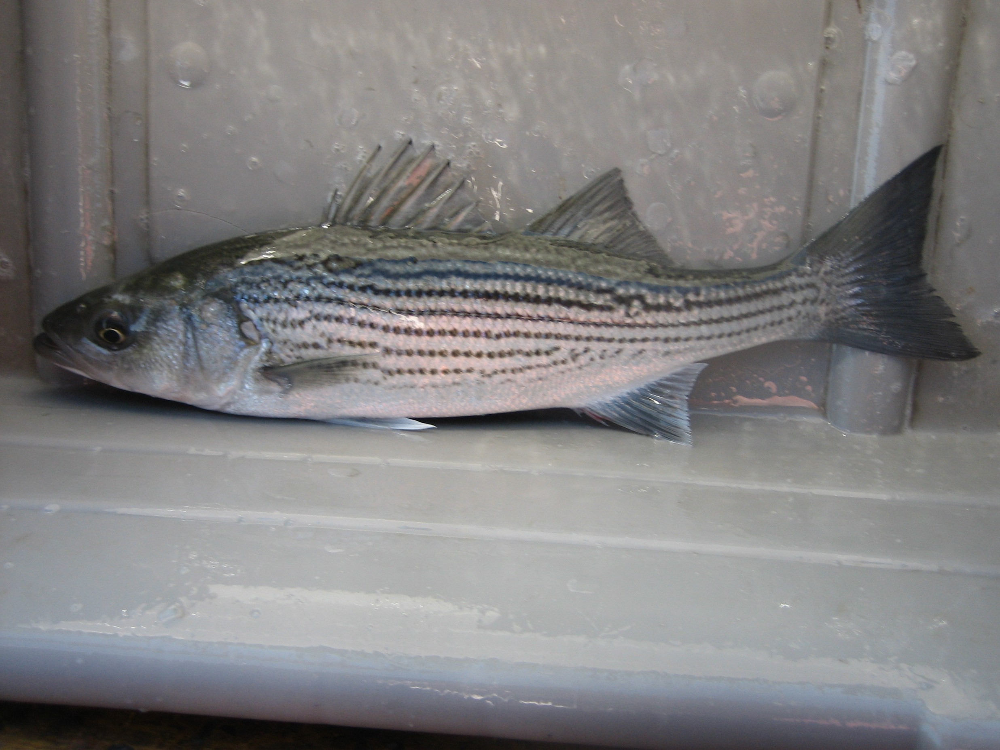
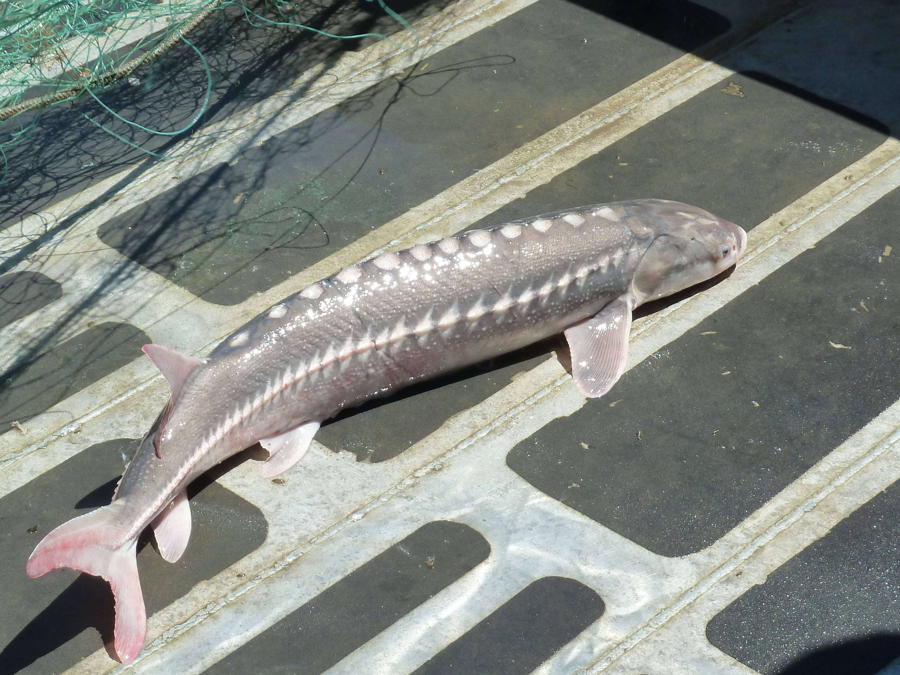

## Introduction

- Striped Bass & Sturgeon
- Data (CDFW & fishery)
- Questions

- Contact: jason.dubois@wildlife.ca.gov

## Mark-recapture

- Mark: disc-dangler tag
- Tag as many fish as possible
- Tagged fish mix with non-tagged fish
- Recapture: subsequent tagging seasons & angling population
- Population metrics

## Helpful Websites

- https://www.wildlife.ca.gov/Fishing/Inland/Striped-Bass
- https://www.wildlife.ca.gov/Conservation/Fishes/Sturgeon
- https://www.wildlife.ca.gov/Licensing/Fishing
- https://www.wildlife.ca.gov/Regulations
- http://www.eregulations.com/california/fishing/freshwater/species-regulations/
- https://www.wildlife.ca.gov/Fishing/Inland
- https://www.wildlife.ca.gov/Fishing/Inland/Fish-Tags

## Striped Bass {.flexbox .vcenter}



```{r child="CVA-StripedBass.Rmd"}

```

## Sturgeon {.flexbox .vcenter}



```{r child="C:/Users/jdubois/Documents/RProjects/SturgeonPopMetrics/presentations/public/CVA-Sturgeon.Rmd"}

```

## Conclusion (Questions)

- Fishery Dependent & Fishery Independent
- CDFW mark-recapture studies
- Disc tag returns & Sturgeon Report Card return

- Questions?

<div class="notes" align="bottom">
  Some notes go here.
</div>
