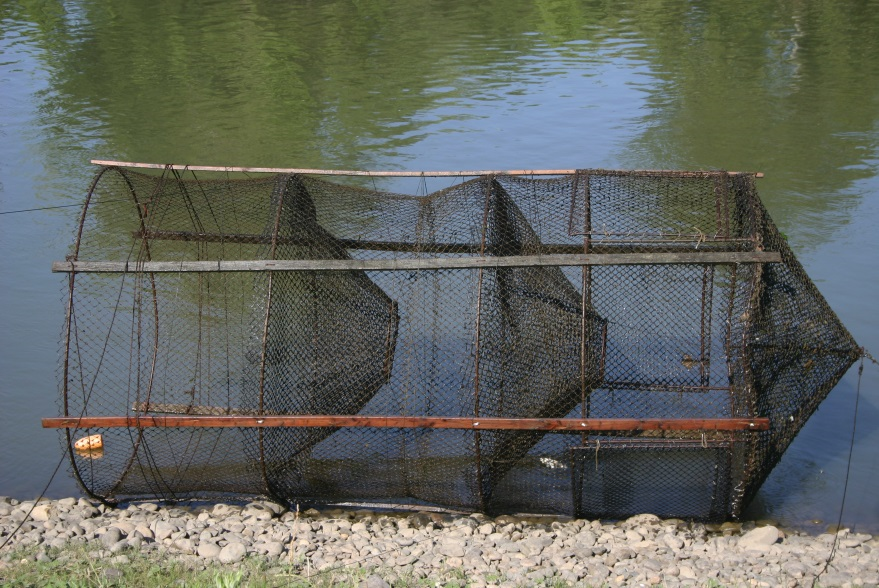
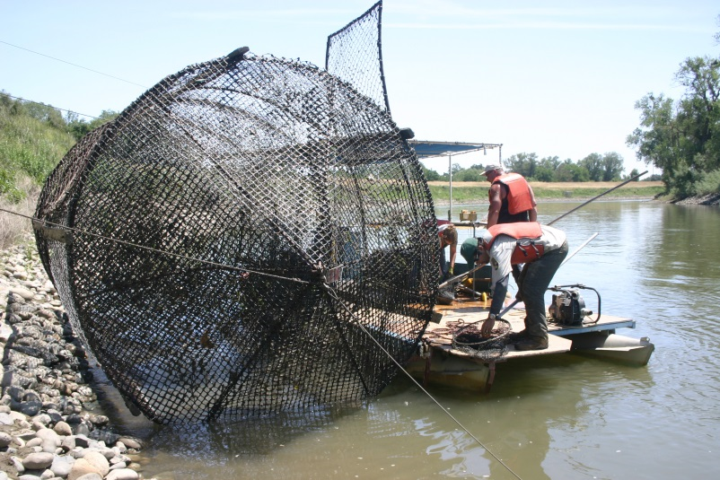
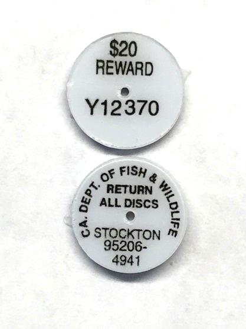
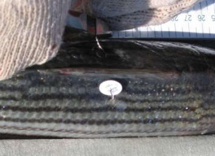

```{r setup-sb, include=FALSE}

knitr::opts_chunk$set(echo = FALSE, fig.align = "center")

knitr::opts_knit$set(
  root.dir = "~/RProjects/StripedBassPopMetrics/",
  global.par = TRUE
)

```

```{r global-par-sb}

par(
  # mar = c(bottom, left, top, right)
  mar = c(4, 4, 1, 1) + 0.1, 
  las = 1,
  mgp = c(3, 0.75, 0),
  cex.axis = 1.25,
  cex.lab = 1.25,
  lend = 2
  # bty = 'n',
  # fg = "transparent"
)

```

```{r load-libraries-sb}

library(sportfish)
# library(knitr)

```

```{r load-data-sb, results='hide'}

SFESuccessful <- readRDS(file = "data/cpfv/SFESuccessful.rds")

Tagging <- new.env()

ReadRDSFiles(fileDir = "data/tagging", envir = Tagging)

```

## Background

- Introduced from Atlantic Coast
- Two plants (1879, 1882)
- Spread quickly in our waters
- Commercial fishing closed 1935

## Biology

- Born in freshwater
- Spawning: mostly Sacramento River
- Move throughout our rivers, bays, coastline
- Legal-size (18") roughly age-3
- Mostly inhabit open waters (pelagic)

- One dorsal fin, spiny- & soft-rayed sections
- Between 6 & 9 horizontal stripes

## Data Collection

- Fishery: dependent & independent
  - CPFV (aka Party Boat)
  - CDFW Striped Bass Tagging Program
  - CDFW Summer Townet Survey
  - CDFW Fall Midwater Trawl
  - CDFW San Francisco Bay Study
  - Salvage Monitoring

## Mark-recapture (Tagging) Program

- Ongoing since 1969
- Affix one Peterson disc tag
- Provides population metrics
- Creel census (now defunct)

---

<div class="centered">

</div>

[Knights Landing](https://www.bing.com/maps?q=knights+landing&form=EDGTCT&qs=PF&cvid=aa37fa532a4b409f81606ce590c6d5d0&refig=4d86ce1db7d54c68c0d0eab7002ace42&cc=US&setlang=en-US)

---

<div class="centered">

</div>

---




## Party Boat

<!-- annual catch, effort, cpue -->

```{r cpfv-catch-sb}

max_kept <- max(SFESuccessful[["NumKept"]])

div <- 1000

# plot(
#   x = range(SFESuccessful[["Year"]]),
#   y = range(SFESuccessful[["NumKept"]]),
#   type = "n",
#   ylab = sprintf("Number kept (x %s)", div),
#   yaxt = "n"
# )

plot(
  formula = NumKept ~ Year,
  data = SFESuccessful,
  type = "h",
  ylim = c(0, max_kept),
  lwd = 5,
  ylab = sprintf("Number kept (x %s)", div),
  yaxt = "n"
)

yax_vals <- axTicks(side = 2)
# par()$xaxp

axis(side = 2, at = yax_vals, labels = yax_vals / div)

```

---

```{r cpfv-effort-sb}

# plot(AnglerHours ~ Year, data = SFESuccessful, type = "h")

max_hours <- max(SFESuccessful[["AnglerHours"]])

div <- 1000

# plot(
#   x = range(SFESuccessful[["Year"]]),
#   y = range(SFESuccessful[["NumKept"]]),
#   type = "n",
#   ylab = sprintf("Number kept (x %s)", div),
#   yaxt = "n"
# )

plot(
  formula = AnglerHours ~ Year,
  data = SFESuccessful,
  type = "h",
  ylim = c(0, max_hours),
  lwd = 5,
  ylab = sprintf("Angler hours (x %s)", div),
  yaxt = "n"
)

yax_vals <- axTicks(side = 2)
axis(side = 2, at = yax_vals, labels = yax_vals / div)

```

---

```{r cpfv-cpue-sb}

plot(CPUE ~ Year, data = SFESuccessful, type = "n")

box(col= "grey90")

par(xaxp = c(1980, 2018, 38))

grid(lwd = 1000, col = "grey90")
grid(lty = 1, col = "white", lwd = 1)

points(CPUE ~ Year, data = SFESuccessful, type = "b")

```

## Annual Harvest Rate

```{r count-rel-ret}

# View(Tagging[["StripedBass"]])

rel <- aggregate(
  formula = Count ~ RelYear + TagValue,
  data = Tagging[["StripedBass"]],
  FUN = sum,
  subset = RelYear > 1997 & (is.na(TagAction) | TagAction %in% 1)
)

ret <- aggregate(
  formula = RetMode ~ RelYear + RelVal,
  data = Tagging[["TagReturns"]],
  FUN = function(x) {
    c(
      Mail = sum(x %in% 'M'),
      Creel = sum(x %in% 'C'),
      Unk = sum(x %in% 'U')
    )
  },
  subset = RelYear > 1997 & RetYear %in% 1
)

ret <- data.frame(
  ret[c("RelYear", "RelVal")],
  ret[["RetMode"]],
  row.names = NULL,
  stringsAsFactors = FALSE
)

```

```{r rel-ret-sb}

rel_ret <- merge(
  x = rel,
  y = ret,
  by.x = c("RelYear", "TagValue"),
  by.y = c("RelYear", "RelVal"),
  all = TRUE
)

# clean up
rm(rel, ret)

```

```{r hr-sb}

rel_ret$MailRR <- rel_ret[["Mail"]] / rel_ret[["Count"]]

# rel_ret$TagValue <- factor(
#   rel_ret[["TagValue"]],
#   levels = c("20", "50", "100", "NR")
# )

# rr_split <- split(rel_ret[c("TagValue", "MailRR")], f = rel_ret[["RelYear"]])
rr_split <- split(rel_ret, f = rel_ret[["RelYear"]])

harv_rate <- vapply(rr_split, FUN = function(x) {
  
  b <- x[["TagValue"]] %in% "NR"
  
  rr <- min(x[b, "MailRR"] / x[!b, "MailRR"], na.rm = TRUE)
  
  tr <- (x[b, "Mail"] / rr) + x[b, "Creel"]
  
  trel <- x[b, "Count"]
  
  mu <- (x[b, "Mail"] + x[b, "Creel"]) / trel
  
  mu_prime <- tr / trel
  
  c(
    RespRate = rr,
    TotalRet = tr,
    TotalRel = trel,
    Mu = mu,
    MuPrime = mu_prime
  )
  
  
}, FUN.VALUE = numeric(5L))

harv_rate <- data.frame(
  Year = as.numeric(names(rr_split)),
  t(harv_rate)
)

# clean up
rm(rr_split)

```

```{r plot-hr-sb}

plot(
  x = range(harv_rate[["Year"]]),
  y = range(harv_rate[["Mu"]], harv_rate[["MuPrime"]]),
  type = "n",
  xlab = "Year",
  ylab = "Harvest rate"
)

box(col= "grey90")

# par(xaxp = c(1998, 2018, 20), pch = 20, cex = 2)
par(xaxp = c(1998, 2018, 20), pch = 20)

grid(lwd = 1000, col = "grey90")
grid(lty = 1, col = "white", lwd = 1)

points(Mu ~ Year, data = harv_rate, type = "p", col = "steelblue", cex = 2)
points(MuPrime ~ Year, data = harv_rate, type = "p", col = "orange2", cex = 2)

```

<!-- ## Length Frequency {.build} -->
## Length Frequency

```{r plot-len-sb}

stats_fl <- aggregate(
  formula = RelFL ~ RelYear,
  data = Tagging[["StripedBass"]],
  FUN = DescStat,
  subset = RelYear > 2009 & CapMethod %in% 2 & RelFL > 25
)

# for convenience of dataframe output
stats_fl <- data.frame(
  RelYear = stats_fl[["RelYear"]],
  stats_fl[["RelFL"]]
)

stats_fl[] <- lapply(stats_fl, FUN = unlist)

plot(
  formula = RelFL ~ jitter(RelYear),
  data = Tagging[["StripedBass"]],
  subset = RelYear > 2009 & CapMethod %in% 2 & RelFL > 25,
  col = rgb(red = 0, green = 0, blue = 0, alpha = 0.1), 
  pch = 20,
  xlab = "Year",
  ylab = "Fork length (cm)"
)

points(
  formula = Med ~ RelYear,
  data = stats_fl,
  col = "orange2",
  pch = 20,
  cex = 2
)

axis(
  side = 3,
  at = c(2010:2013, 2015:2018),
  labels = stats_fl[["N"]],
  tick = FALSE,
  line = -0.5,
  padj = 1,
  cex.axis = 0.75,
  family = "mono"
)

# boxplot(
#   formula = RelFL ~ RelYear,
#   data = Tagging[["StripedBass"]],
#   subset = RelYear > 2009 & CapMethod %in% 2 & RelFL > 25
# )

```

```{r len-freq-sb, eval=FALSE}

# View(Tagging[["StripedBass"]])

len_freq <- with(data = Tagging[["StripedBass"]], expr = {
  
  b <- RelYear > 2009 & CapMethod %in% 2 & RelFL > 25
  
  xrng <- range(RelFL[b], na.rm = TRUE)
  
  aggregate(
    list(RelFL = RelFL[b]),
    by = list(RelYear = RelYear[b]),
    FUN = Frequency,
    binWidth = 5, xRange = xrng,
    simplify = FALSE
  )
})

inms <- setNames(
  object = seq_along(len_freq[["RelYear"]]),
  nm = len_freq[["RelYear"]]
)

res <- vapply(inms, FUN = function(i) {
  v <- len_freq$RelFL[[i]]
  plot(v, xlab = "FL cm bins")
  mtext(text = names(inms)[i], side = 3, adj = 1, col = "grey25")
  unlist(v$xstats(), use.names = TRUE)
}, FUN.VALUE = numeric(7L))

# t(res)

# clean up
rm(inms)

```

## Catch per Trap-Hour

```{r count-subs-sb, eval=FALSE}

# head(Tagging[["StripedBass"]])
# View(Tagging[["StripedBass"]])

# aggregate(
#   formula = RelFL ~ RelYear,
#   data = Tagging[["StripedBass"]],
#   FUN = function(x) {
#     length(x)
#   },
#   subset = RelFL < 42
# )

lbls <- c(
  `1` = 't', `2` = 'r', `4` = 'n', `5` = 'o',
  `6` = 'd', `7` = 'c', `NA` = 't'
)

count_subs <- aggregate(
  # formula = Count ~ RelYear,
  formula = Count ~ RelYear  + factor(TagAction, labels = lbls, exclude = NULL),
  # formula = Count ~ RelYear  + addNA(TagAction, ifany = TRUE),
  data = Tagging[["StripedBass"]],
  FUN = sum,
  # FUN = function(x) sum(x > 1),
  subset = (RelFL < 42 & RelFL > 0) & RelYear > 2009#,
  # na.action = na.pass
)

colnames(count_subs) <- c("Year", "Action", "Count")

xtabs(formula = Count ~ Year + Action, data = count_subs)

```

```{r rel-date-dups, eval=FALSE}

# run FIO: gets count of traps by date in Effort data where traps were fished
# more than once in a day; i.e., a trap was tended rolled back in the water and
# then tended again that same day

with(data = Tagging[["Effort"]], expr = {
  l <- split(DriftTrap, f = RelDate)
  r <- vapply(l, FUN = function(x) sum(duplicated(x)), FUN.VALUE = numeric(1L))
  r[r > 0]
})

```

```{r effort-date-sb}

# creates dataframe of effort by release date, gives total hours fished along
# with daily average & variance along with number of traps fished

split_effort_date <- split(
  Tagging[["Effort"]],
  f = Tagging[["Effort"]]["RelDate"],
  drop = TRUE
)

effort_date <- vapply(
  split_effort_date,
  FUN = EffortSb,
  # FUN.VALUE = list(
  #   Hours = NA, HoursAvg = NA, HoursVar = NA,
  #   NetCount = NA, NetCountDup = NA
  # ),
  FUN.VALUE = as.list(1:5),
  StartTime, EndTime, DriftTrap
)

# for desired formatting & use in future analytics
effort_date <- data.frame(
  RelDate = as.Date(names(split_effort_date)),
  t(effort_date),
  row.names = NULL,
  stringsAsFactors = FALSE
)

effort_date[] <- lapply(effort_date, FUN = unlist, use.names = FALSE)

# head(effort_date)

```

```{r catch-sb}

# create summary for catch of sub-legals & summary for catch of legal-sized fish
# (summary by release date), then merge to create single catch dataframe

catch_date_subs <- aggregate(
  formula = Count ~ RelDate,# + DriftTrap,
  data = Tagging[["StripedBass"]],
  FUN = sum,
  # subset = RelYear == 2011
  subset = (RelFL < 42 & RelFL > 25) & RelYear > 2009
  # subset = RelYear > 2017
)

catch_date_all <- aggregate(
  formula = Count ~ RelDate,
  data = Tagging[["StripedBass"]],
  FUN = sum,
  subset = RelFL >= 42 & RelYear > 2009
  # subset = RelFL > 25 & RelYear > 2009
)

# for matching
catch_date_subs$RelDate <- as.Date(catch_date_subs[["RelDate"]])
catch_date_all$RelDate <- as.Date(catch_date_all[["RelDate"]])

catch <- merge(
  x = catch_date_all,
  y = catch_date_subs,
  by = "RelDate",
  all = TRUE,
  suffixes = c("All", "Subs")
)

rm(catch_date_all, catch_date_subs)

```

```{r calc-cpue-sb}

# matches effort with catch data & then calculates cpue for subs and legals

index <- match(effort_date[["RelDate"]], table = catch[["RelDate"]])

# _all in this case is legal-sized fish
cpue_all <- catch[["CountAll"]][index] / effort_date[["Hours"]]
cpue_subs <- catch[["CountSubs"]][index] / effort_date[["Hours"]]

rm(index)

```

```{r cpue-date-sb, eval=FALSE}

aggregate(
  formula = cbind(cpue_all, cpue_subs) ~ RelDate,
  data = effort_date,
  # FUN = mean,
  FUN = function(x) {
    nall <- length(x)
    x <- x[!is.na(x)]
    c(
      NAll = nall,
      N = length(x),
      Mean = mean(x),
      Var = var(x),
      SE = sqrt(var(x) / length(x))
    )
  },
  # na.rm = TRUE,
  subset = format(RelDate, "%Y") > 2009
)

```

```{r res-cpue-sb}

# calculate annual cpue with mean +/- 95% CI

res <- aggregate(
  formula = cbind(cpue_all, cpue_subs) ~ as.numeric(format(RelDate, "%Y")),
  data = effort_date,
  # FUN = mean,
  FUN = function(x) {
    nall <- length(x)
    x <- x[!is.na(x)]
    c(
      NAll = nall,
      N = length(x),
      Mean = mean(x),
      Var = var(x),
      SE = sqrt(var(x) / length(x))
    )
  },
  # na.rm = TRUE,
  subset = format(RelDate, "%Y") > 2009
)

cpue <- data.frame(
  RelYear = res$`as.numeric(format(RelDate, "%Y"))`,
  All = res[["cpue_all"]],
  Subs = res[["cpue_subs"]]
)

rm(res)

```

```{r plot-cpue-sb}

plot(
  x = range(cpue$RelYear),
  y = range(
    cpue$All.Mean + (1.96 * cpue$All.SE),
    cpue$Subs.Mean - (1.96 * cpue$Subs.SE)
  ),
  type = "n",
  xlab = "Year",
  ylab = "Catch / trap-hour",
  xaxt = "n"
)

box(col= "grey90")

# axTicks(side = 1)
axis(
  side = 1, at = (2010:2018)[c(TRUE, FALSE)],
  labels = (2010:2018)[c(TRUE, FALSE)],
  col.axis = "grey20"
)

axis(
  side = 1, at = 2010:2018,
  labels = NA,
  col.ticks = "grey20"
)

# for grid lines & grey background *****
par(xaxp = c(2010, 2018, 8))

grid(lwd = 1000, col = "grey90")
grid(lty = 1, col = "white", lwd = 1)
# **************************************

col_subs <- "steelblue"
col_legl <- "orange2"

# add error bars & points for sub-legals
segments(
  x0 = cpue$RelYear - 0.05,
  y0 = cpue$Subs.Mean - (1.96 * cpue$Subs.SE),
  y1 = cpue$Subs.Mean + (1.96 * cpue$Subs.SE),
  col = col_subs,
  lwd = 2
)

points(
  x = cpue$RelYear - 0.05,
  y = cpue$Subs.Mean,
  col = col_subs,
  cex = 1.1,
  pch = 20
)

# add error bars & points for legals
segments(
  x0 = cpue$RelYear + 0.05,
  y0 = cpue$All.Mean - (1.96 * cpue$All.SE),
  y1 = cpue$All.Mean + (1.96 * cpue$All.SE),
  col = col_legl,
  lwd = 2
)

points(
  x = cpue$RelYear + 0.05,
  y = cpue$All.Mean,
  col = col_legl,
  cex = 1.1,
  pch = 20
)

```

```{r count-length-sb, eval=FALSE}

with(data = Tagging[["StripedBass"]], expr = {
  
  # for all records where FL > 0 and is not NA count = 1; so we don't have to
  # worry about frequency, we can sum(Count) or get length(FL) both should be
  # equal; i.e., result should be TRUE
  
  b <- RelFL > 0 & !is.na(RelFL)
  
  # all(Count[b] == 1)
  
  identical(x = sum(Count[b]), y = length(RelFL[b]))
  
})

```

## Fraction (sub-legal v. legal)
 
```{r frac-subs-leg-sb, comment=""}

# gets annually fraction of sublegals caught & fraction of legal-sized caught

out <- aggregate(
  formula = RelFL ~ RelYear,
  data = Tagging[["StripedBass"]],
  FUN = function(x) {
    b <- x >= 42
    
    c(Sub = mean(!b), Leg = mean(b))
    
  },
  subset = (!is.na(RelFL) & RelFL > 0) & RelYear > 2009
)

out <- data.frame(
  RelYear = out[["RelYear"]],
  out[["RelFL"]]
)

out

```

```{r unk-sb, eval=FALSE}

# TODO: decide wheter to keep or delete

plot(
  formula = RelFL ~ jitter(RelYear),
  data = Tagging[["StripedBass"]],
  subset = (RelFL < 42 & RelFL > 25) & RelYear > 2009
  # subset = RelFL > 25 & RelYear > 2009
)

```
