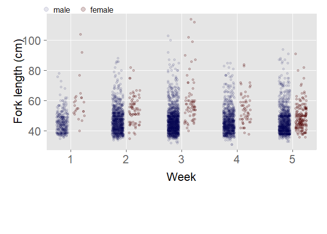

## Introduction

An adult Striped Bass population study conducted by the California
Department of Fish and Wildlife has been ongoing since 1969. Part of the
study is a “high-value” reward tagging program. Presented here is a
summary of the 2019 Striped Bass-tagging field season.

The tagging program is designed to understand and monitor the population
dynamics of Striped Bass, with the ultimate goal being to provide the
tools to inform science-based resource management decisions. These tools
include relative and absolute abundance, harvest rate, mortality rate,
individual growth rates, and large-scale movement and (or) migration
patterns.

Our objective during the field season was to capture, tag, measure, sex,
and release in good condition as many Striped Bass as possible and to
document previously-tagged Striped Bass. We also enumerated all by-catch
(i.e., fish other than Striped Bass), recording approximated length,
coloration, condition, and adipose fin (presence or absence) for
salmonids.

<!--
## Methods and Gear

The crew (Appendix 1) typically included an Environmental Scientist, two Fish and Wildlife Technicians, and a Mate. Tagging was performed per procedure outlined in Appendix 2 of the Sacramento-San Joaquin Sport Fish Management Striped Bass Population Study Quality Control and Operating Manual.

Up to nine cylindrical fyke traps (length 20'; diameter 10'; 9 gauge 2¼-inch mesh) were fished in the Sacramento River near Knights Landing (see photo at right of a
fyke trap). Four traps were placed on the east riverbank about two miles upstream of the Knights Landing Bridge (Highway 113). Four traps were placed on the east riverbank about one mile downstream of the Knights Landing Bridge.Traps were placed
upwards of 250 feet apart from each other and were secured to temporary (i.e., for the season) moorings on the levee terrace.

Traps were completely submerged while fishing (collecting fish). Striped Bass and other fishes swam through the two openings (marked in photo above) and accumulated in the front (cone) of the trap. To remove fish from a trap, the trap was rolled up the riverbank until one of the doors was positioned to allow relatively easy access from the *Kayot* (~20-foot pontoon boat) while ensuring the trap remained in enough water to minimize fish stress.

An electric winch was used to roll traps up and down the riverbank. When the trap and boat were in position, fish were netted from the trap and processed on board the *Kayot*.

...continues Striped Bass were measured to

-->

## Annual & Daily Summary

Herein we summarize 2019 effort and catch. We use both to calculate
catch-per-unit-effort (CPUE).

### Effort

In 2019, we deployed fyke traps 15 days between 07-May and 07-Jun. Most
days we fished up to 9 traps, with season totals of 130 traps fished
over \~3097 hours.

**Note**: On 15-May, we checked all 9 traps but did not handle any fish.
Catch was markedly low this day, and we did not observe any ESA species.
Inadvertently, we forgot to record the pull time for each trap. Thus,
effort and catch “rolled” into the next tagging day (16-May).

### Catch

This season we tended between 7 and 9 traps each day (exception noted
above), totaling 120. We caught 5064 Striped Bass, of which 3428 were
then disc tagged. Daily (d) and daily per trap (d/t) totals and tagged
(min, max, & average) are displayed below.

|     | Total (d) | Tagged (d) | Total (d/t) | Tagged (d/t) |
| :-- | --------: | ---------: | ----------: | -----------: |
| Min |        95 |         88 |           1 |            0 |
| Max |       775 |        438 |         237 |          186 |
| Avg |       362 |        245 |          42 |           29 |

## Recaptures

We had 54 recaptures this season from 3 different tagging (release)
years. Most were within season (i.e., released & recaptured the same
year; for 2019 n=47).

Below we display all recaptured tags in 2019. For recaptures from
previous years, we calculated growth per year (`GPY`) where possible. We
show `DateRec` (date recaptured, all year 2019), `DateTag` (date tag
released), `DAL` (days at large between release-recapture), and length
when tagged and when recaptured (`LenTag` & `LenRec`).

**Note**: For within season recaptures, any discrepancies between
`LenTag` and `LenRec` are due to inadvertent measuring and (or)
recording errors.

**Note**: We recaptured five (5) Striped Bass on the same day each was
tagged (not shown in table below).

| TagNum | DateRec | DateTag    | DAL | LenTag | LenRec |  GPY |
| :----- | :------ | :--------- | --: | -----: | -----: | ---: |
| 294670 | 06-07   | 2017-04-27 | 771 |     42 |     48 | 2.84 |
| 294548 | 05-22   | 2017-04-26 | 756 |     43 |     55 | 5.80 |
| 295707 | 05-30   | 2017-05-04 | 756 |     32 |     48 | 7.73 |
| C02305 | 05-22   | 2018-05-01 | 386 |     42 |     50 | 7.57 |
| 298083 | 05-29   | 2018-05-10 | 384 |     44 |     49 | 4.76 |
| 298336 | 06-04   | 2018-05-16 | 384 |     56 |     NA |   NA |
| 297875 | 05-14   | 2018-05-08 | 371 |     45 |     53 | 7.88 |
| 298978 | 05-16   | 2019-05-14 |   2 |     39 |     40 |   NA |
| 300926 | 06-06   | 2019-06-04 |   2 |     50 |     50 |   NA |
| 299204 | 05-17   | 2019-05-16 |   1 |     48 |     48 |   NA |
| 299205 | 05-17   | 2019-05-16 |   1 |     46 |     46 |   NA |
| 299276 | 05-17   | 2019-05-16 |   1 |     40 |     40 |   NA |
| 299340 | 05-17   | 2019-05-16 |   1 |     39 |     39 |   NA |
| 299571 | 05-22   | 2019-05-21 |   1 |     42 |     41 |   NA |
| 299576 | 05-22   | 2019-05-21 |   1 |     64 |     65 |   NA |
| 299583 | 05-22   | 2019-05-21 |   1 |     59 |     59 |   NA |
| 299702 | 05-23   | 2019-05-22 |   1 |     49 |     49 |   NA |
| 299712 | 05-23   | 2019-05-22 |   1 |     38 |     40 |   NA |
| 299716 | 05-23   | 2019-05-22 |   1 |     45 |     50 |   NA |
| 299735 | 05-23   | 2019-05-22 |   1 |     45 |     45 |   NA |
| 299753 | 05-22   | 2019-05-21 |   1 |     41 |     40 |   NA |
| 299757 | 05-22   | 2019-05-21 |   1 |     49 |     45 |   NA |
| 299769 | 05-22   | 2019-05-21 |   1 |     69 |     69 |   NA |
| 299816 | 05-23   | 2019-05-22 |   1 |     45 |     46 |   NA |
| 299837 | 05-23   | 2019-05-22 |   1 |     42 |     42 |   NA |
| 299852 | 05-23   | 2019-05-22 |   1 |     66 |     66 |   NA |
| 299856 | 05-23   | 2019-05-22 |   1 |     44 |     45 |   NA |
| 300241 | 05-30   | 2019-05-29 |   1 |     77 |     76 |   NA |
| 300273 | 05-30   | 2019-05-29 |   1 |     52 |     51 |   NA |
| 300276 | 05-30   | 2019-05-29 |   1 |     43 |     44 |   NA |
| 300303 | 05-30   | 2019-05-29 |   1 |     37 |     37 |   NA |
| 300318 | 05-30   | 2019-05-29 |   1 |     59 |     59 |   NA |
| 300330 | 05-30   | 2019-05-29 |   1 |     52 |     52 |   NA |
| 300415 | 05-30   | 2019-05-29 |   1 |     58 |     58 |   NA |
| 300427 | 05-30   | 2019-05-29 |   1 |     47 |     47 |   NA |
| 300475 | 05-30   | 2019-05-29 |   1 |     43 |     44 |   NA |
| 300480 | 05-30   | 2019-05-29 |   1 |     38 |     39 |   NA |
| 300550 | 05-30   | 2019-05-29 |   1 |     45 |     46 |   NA |
| 300564 | 05-30   | 2019-05-29 |   1 |     40 |     40 |   NA |
| 300713 | 06-05   | 2019-06-04 |   1 |     61 |     62 |   NA |
| 300717 | 06-05   | 2019-06-04 |   1 |     45 |     45 |   NA |
| 300927 | 06-05   | 2019-06-04 |   1 |     55 |     55 |   NA |
| 300929 | 06-05   | 2019-06-04 |   1 |     56 |     56 |   NA |
| 300979 | 06-06   | 2019-06-05 |   1 |     40 |     40 |   NA |
| 301113 | 06-06   | 2019-06-05 |   1 |     50 |     50 |   NA |
| 301169 | 06-06   | 2019-06-05 |   1 |     50 |     50 |   NA |
| 301184 | 06-06   | 2019-06-05 |   1 |     50 |     50 |   NA |
| 301260 | 06-06   | 2019-06-05 |   1 |     41 |     40 |   NA |
| 301382 | 06-07   | 2019-06-06 |   1 |     50 |     49 |   NA |
| 301450 | 06-07   | 2019-06-06 |   1 |     50 |     51 |   NA |
| C02468 | 06-07   | 2019-06-06 |   1 |     43 |     43 |   NA |
| F02410 | 05-23   | 2019-05-22 |   1 |     41 |     42 |   NA |
| F02457 | 06-07   | 2019-06-06 |   1 |     54 |     55 |   NA |
| Y12503 | 05-22   | 2019-05-21 |   1 |     64 |     62 |   NA |

## Catch per Trap Hour

Daily average river stage for the Knights Landing-portion of the
Sacramento River was calculated from quarter-hourly readings (n=96/day)
posted on-line at the California Data Exchange Center’s website. River
stage declined a bit early May, but mid-May rains maintained levels
between \~25 and 28 feet for the season’s duration (Figure below – top
panel).

Water temperature was recorded by the field crew at the beginning of
each tagging day. Average water temperature was 17.1 degrees Celsius
(°C, or \~62.9 degrees Fahrenheit) for the tagging season (Figure below
– middle panel).

Striped Bass catch per trap-hour by day was calculated and plotted with
river stage and water temperature. Average catch per trap-hour for the
tagging season was \~1.6 fish (Figure below – bottom panel; average
denoted with orange dashed line).

<!-- -->

## Weekly Catch

Below we display weekly numbers for total caught (and then parsed by
tagging action: tagged; creeled; over; dead; recaptured), traps tended,
and days fished. Despite a moderate week 1, we tagged many hundreds of
Striped Bass each week.

**Note**: Days fished does not include 15-May (week 2), as on that day
we checked each trap but did not handle fish. In week 2, we fished 4
days.

| Week | Total | Tagged | Creeled | Over | Dead | Recapture | TrapsTended | DaysFished |
| ---: | ----: | -----: | ------: | ---: | ---: | --------: | ----------: | ---------: |
|    1 |   342 |    337 |       0 |    5 |    0 |         0 |          14 |          2 |
|    2 |  1055 |    838 |     181 |   27 |    3 |         6 |          27 |          3 |
|    3 |  1466 |    722 |     691 |   35 |    0 |        18 |          26 |          3 |
|    4 |   935 |    606 |     294 |   19 |    2 |        14 |          18 |          2 |
|    5 |  1266 |    925 |     283 |   38 |    4 |        16 |          35 |          4 |

Below we display weekly length measurement stats. `N` denotes number of
Striped Bass measured (includes both sexes). `Var` is the variance
around the mean (`Avg`). We do not observe much week-to-week variation
in mean fork length.

| Week |    N | Min | Max |  Avg | Med |  Var |
| ---: | ---: | --: | --: | ---: | --: | ---: |
|    1 |  336 |  35 | 104 | 46.6 |  45 | 70.2 |
|    2 | 1021 |  34 |  88 | 47.4 |  46 | 72.0 |
|    3 | 1426 |  32 | 114 | 47.4 |  46 | 89.4 |
|    4 |  915 |  31 |  85 | 46.9 |  45 | 73.2 |
|    5 | 1221 |  33 |  94 | 46.8 |  45 | 76.4 |

## Sex Ratio

Below we display the sex ratio along with fork length stats by sex. The
ratio is skewed noticeably towards males (M). On average, females (F)
were larger than males, but we observed much greater variance (`Var`) in
female lengths than in male lengths. `NAll` is total catch and `N` is
number measured. Sex `U` is unknown (i.e., not recorded).

| Sex | Ratio | NAll |    N | Min | Max |    Avg | Med |     Var |
| :-- | ----: | ---: | ---: | --: | --: | -----: | --: | ------: |
| M   | 0.891 | 4513 | 4509 |  31 | 103 | 46.548 |  45 |  69.286 |
| F   | 0.079 |  399 |  399 |  35 | 114 | 53.546 |  51 | 134.942 |
| U   | 0.030 |  152 |   11 |  38 |  62 | 47.364 |  45 |  83.055 |

Below we display weekly length distributions by sex. Each point is one
Striped Bass, and ‘noise’ has been added to reduce over-plotting. We
note (1) some of the largest fish this season appeared in week 3 and (2)
a more females were observed in the final week (5) than in each of the
previous four.

<!-- -->

## Length Frequency

Of the fish for which a length measurement was recorded (n=4919), length
ranged 31-114 cm FL and averaged 47.1 ± 8.8 cm FL (± SD). Below we
display annual length frequency distributions from 2015 to 2019. The
vertical dashed line (orange) denotes median length. Length bins are 5
cm, and all bars left of bin 42 denote sub-legal sized fish. The
fraction of sub-legal sized fish has varied annually: 0.196 (2015);
0.405 (2016); 0.440 (2017); 0.315 (2018); 0.286 (2019).

<!-- -->

## ByCatch

We caught 11 different species this season. By far the largest fraction
was AS (0.945). We caught 5 Chinook Salmon with approximated lengths
between 50 and 67. All salmon were released alive, most in excellent
condition. Below are seasonal (2019) by-catch totals.

**Note**: The one White Sturgeon (WST) was caught 17-May and measured
\~139 cm FL.

| SpeciesCode | Count |
| :---------- | ----: |
| AS          |  1090 |
| BCR         |     7 |
| CCF         |    28 |
| HH          |     1 |
| KS          |     5 |
| SASU        |     3 |
| SPB         |    14 |
| SQ          |     3 |
| TP          |     1 |
| WCF         |     1 |
| WST         |     1 |

## Tag Sequence

Below we display the sequence of tags (by value) and count (`N`)
released this season (2019). `NR` denotes non-reward. Roughly about 10%
of tags released are reward tags.

| TagValue | From   | To     |   N |
| :------- | :----- | :----- | --: |
| NR       | 298388 | 298389 |   2 |
| NR       | 298448 | 298778 | 331 |
| NR       | 298780 | 299041 | 262 |
| NR       | 299043 | 299545 | 503 |
| NR       | 299547 | 299619 |  73 |
| NR       | 299621 | 300545 | 925 |
| NR       | 300547 | 300619 |  73 |
| NR       | 300621 | 301003 | 383 |
| NR       | 301005 | 301057 |  53 |
| NR       | 301059 | 301065 |   7 |
| NR       | 301067 | 301366 | 300 |
| NR       | 301368 | 301442 |  75 |
| NR       | 301444 | 301539 |  96 |
| $20      | Y12460 | Y12574 | 115 |
| $50      | F02357 | F02357 |   1 |
| $50      | F02360 | F02473 | 114 |
| $100     | C02359 | C02473 | 115 |

-----

CDFW, SportFish Unit  
2019-10-17
