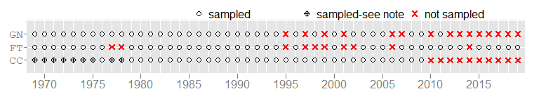
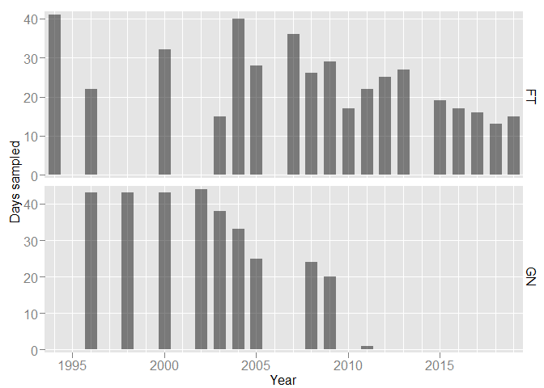
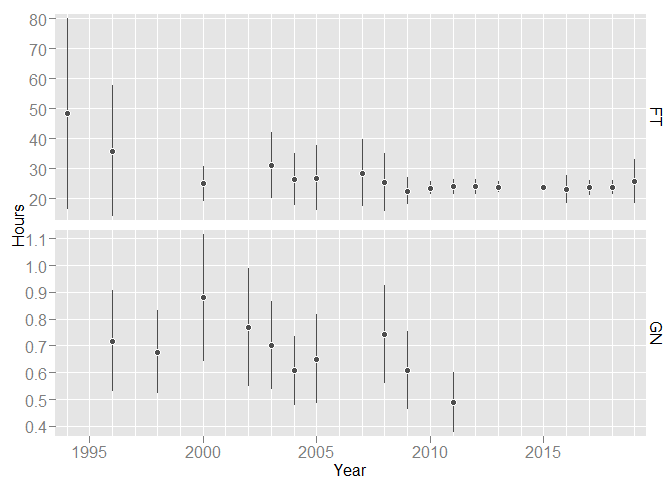
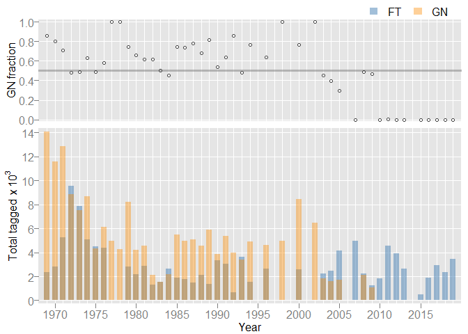
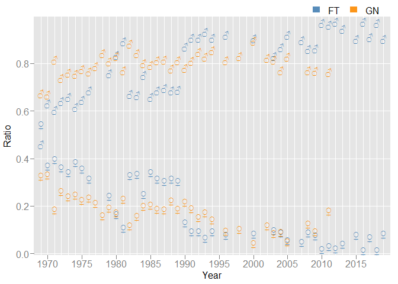
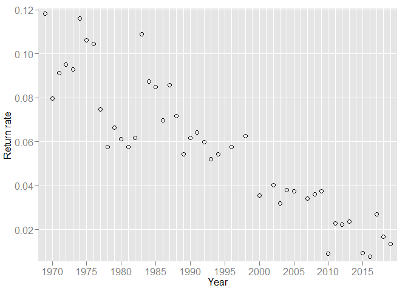
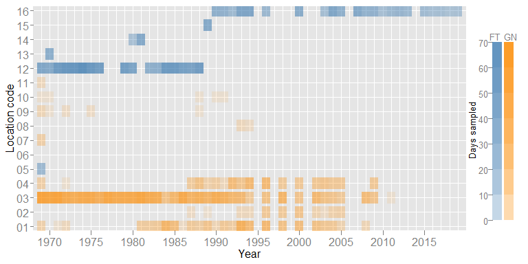

The California Department of Fish and Wildlife’s (CDFW) Bay Delta
(Stockton) Sportfish Unit provides herein a detailed review of the adult
Striped Bass population study. Such a review was requested by
Interagency Ecological Program (IEP) management. This review chronicles
the study’s history, evaluates original objectives with the needs of
today, and provides recommenations for improvements.

March 02, 2020  
CDFW, Sportfish Unit

# Basic Information & Program Element Description

<!-- Basic Information & Program Element Description -->

**Program Title**: Adult Striped Bass Population Estimates  
**Program Element Number (PEN)**: 002  
**Agency**: California Department of Fish & Wildlife (CDFW)

Principal Investigators:  
\- [Andrew Danos, CDFW](mailto:andrew.danos@wildlife.ca.gov)  
\- [Jason DuBois, CDFW](mailto:jason.dubois@wildlife.ca.gov)

## Project Description

Nearly annually since 1969, the CDFW has conducted a mark-recapture
study on adult (i.e., ≥ age-3) Striped Bass (*Morone saxatilis*). Data
collected provide estimates of abundance (absolute and relative),
harvest rate (exploitation), survival rate, growth, harvest, and
large-scale migration. Age compostion — as estimated from scale
examination — allows for stratifying some metrics accordingly.

<!-- not sure below belongs in this section -->

To collect Striped Bass, fyke traps and gill nets are deployed during
peak spawning (Mar-Jul, more typically Apr-May). Fyke traps are set
along the banks of the upper Sacramento River (e.g., Knights Landing),
and gill nets are deployed typically at the confluence of the Sacramento
and San Joaquin rivers. For both gear types, time set and time pulled
are recorded per each deployment.

To most legal-sized Striped Bass, one disc tag is affixed just below the
dorsal fin’s spiny section (typically between spines 3 and 4). Up to 10
scales are collected per fish for later age assessment. Fish are
measured and sexed, and then released to the area nearest capture. Fish
not tagged are enumerated and as time allows measured and (or) sexed.
Recaptures (i.e., Striped Bass previously disc tagged) are recorded,
noting length, sex, and tag number. Bycatch are identified to species
and enumerated.

#### Research Problem

#### Research Objectives

Originally, this project’s main goal expressed supporting a robust
recreational fishery through effective management. Data collected would
establish and then monitor fishing regulations comensurate with said
goal. Of further importance was understanding factors affecting
abundance given recent and future environmental changes (e.g., water
diversion).

Data collected using mark-recapture methods were analyzed to provide
important population metrics (e.g., abundance; harvest rate; survival
rate). Such metrics would guide appropriate management of the Striped
Bass recreational fishery.

#### Research Questions

1)  What are the population dynamics of Striped Bass in the
    Sacramento-San Joaquin Delta and San Francisco Estuary?

2)  Do existing laws and regulations governing the fishery need to be
    changed?

3)  Are there any regulatory recommendations needed to change the
    Striped Bass population?

<!-- project's relation to IEP science strategy & Delta Science Action Agenda -->

# Program Element Historical Details

<!-- Program Element Historical Details -->

## Study Design & Objective

To collect Striped Bass, the CDFW deploys fyke traps and gill nets
during peak spawning (Mar-Jul, more typically Apr-May). Fyke traps are
set along the banks of the upper Sacramento River (e.g., Knights
Landing), and gill nets are deployed typically at the confluence of the
Sacramento and San Joaquin rivers. For both gear types, time set and
time pulled are recorded per each deployment.

To most legal-sized Striped Bass, one disc tag is affixed just below the
dorsal fin’s spiny section (typically between spines 3 and 4). Up to 10
scales are collected per fish for later age assessment. Fish are
measured and sexed, and then released to the area nearest capture. Fish
not tagged are enumerated and as time allows measured and (or) sexed.
Recaptures (i.e., Striped Bass previously disc tagged) are recorded,
noting length, sex, and tag number. Bycatch are identified to species
and enumerated.

<!-- Noted too is any evidence of a captured Striped Bass having shed a disc tag and (or) if it needed to be re-tagged. -->

<!-- *Note*: disc tags are sequentially numbered with a 6-character alpha-numeric (i.e., the tag number; e.g., C01234 [\$] or 299999 [no \$]). -->

Currently, fyke traps fish 24 hours between inspections. We typically
set fyke traps on Monday and handle and tag Striped Bass Tuesday through
Friday. Field days typically begin at 0730 ending around 1730, varying
according to catch and processing.

We record the following information for each fyke trap. Further, we note
any unusual procedures (e.g., trap vandalism; debris load). We record
water temperature (to nearest 0.5 degree Celsius) once at the start of
each field day.

  - trap number
  - daily set & pull times
  - bycatch (other species)
  - pinnipeds (seals or sea lions) in or within 50 meters of the trap

We record the following information for each gill net set. Further, we
note any unusual procedures (e.g., snags; other vessel interactions). We
record water temperature (to nearest 0.5 degree Celsius) once at the
start of each field day.

  - set number
  - amount of net fished
  - net set & net pull times
  - location fished
  - bycatch (other species)\[1\]
  - pinnipeds (seals or sea lions) in or within 50 meters of the
    trap\[2\]
  - pinnipeds raiding the net (i.e., picking fish from the net)\[3\]

\[1\]: within the “remarks” section of the daily summary datasheet

On the tagging datasheet (same for both fyke trap and gill net), we
record the following information. A datasheet has space for 25 tags.

  - header: date, location, capture method (fyke or gill net), tagger
    name
  - tag number (two numbers if double-tagging study)
  - fork length (cm)
  - sex (♂ = 1, ♀ = 2)
  - tag description (i.e., tag value)
  - condition upon release (good = 1, 2 otherwise)
  - trap or set number (in “remarks” section)

## Sampling Methods

We (CDFW) use gill nets and fyke traps to catch mostly adult Striped
Bass. Sampling occurs during the spawning run (Mar-Jul, more typcially
Apr-May). We deploy gill nets daily mostly in or around the
Sacramento-San Joaquin confluence. We deploy fyke traps along select
stretches of the Sacramento River.

The objective is to catch and then disc tag as many Striped Bass as
possible. We use the current legal size as the cutoff for fish receiving
a tag. Fish less than such length are enumerated, and then measured and
(or) sexed as time allows.

Striped Bass deemed “taggable” receive a single disc tag just below the
dorsal fin on the right side. Disc tags are sequentially numbered with a
6-character alpha-numeric (i.e., the tag number). Along with tag number,
fork length (in centimeters \[cm\]), mesh size(?), fish condition at
release (good; fair; poor), set or trap number are recorded. Noted too
is any evidence of a captured fish having shed a disc tag and (or) if a
captured fish needed to be re-tagged.

Fyke trap sampling typically occurs Tuesday through Friday from roughly
dawn until late afternoon. Traps are deployed on Monday to begin
fishing, and thus no fish are handled. Using wire, cable, and rope, fyke
traps are set in fixed positions on the levee. Traps are deployed to the
water using a winch and pull cable. Trap locations are selected based on
levee terrain and river depth (i.e., for complete submergence).

Gill net sampling typically occurs Monday through Friday from roughly
dawn until mid afternoon. The gill net is set in locations selected by
the boat operator to avoid known snags and unfavorable currents. The net
is deployed cross current with the vessel downwind. On average, it takes
approximately five minutes to set the net. We continuously monitor the
deployed net to detect snags, tangles, marine mammal interactions, and
to avoid conflicts with other vessels and hazards such as channel
markers. The net is set as many times (usually 4-6) as possible each
field day, with each set lasting up to \~55 minutes.

<!--
We record the following information for each net set. Further, we note any unusual procedures (e.g., had to pull net early due to possible snag).

- net length
- general geographic area (e.g., Suisun Bay)
- latitude & longitude at the start of the net set
- start & end times for net set & net retrieval
- personnel (disc tagger & data recorder)
- tidal state (as ebb, floor, or slack)
- wind & wave conditions based on the Beaufort scale (0-12)
- water temperature (to nearest 0.5 degree Celsius)
- number of pinnipeds (seals or sea lions) within 50 meters of the net
- pinnipeds raiding the net (yes or no)
- other vessel interactions (yes or no)
-->

<!-- <TODO: more narrative for study description / design here> -->

<!-- - objective with data (mark-recapture) -->

#### changes (come up with more descriptive section name)

<!-- below for sturgeon change wording herein accordinlgy

Up until <YYYY>, we only disc tagged legal-sized sturgeon. Beginning in <20YY>, we attempted to disc tag every sturgeon but smaller fish (i.e., < 100 cm TL) proved challenging to gauge in terms of excess wire and growth < explain better > .

In 2013, responding to concers from National Marine Fisheries Services (NMFS) about handling listed species we stopped disc tagging Green Sturgeon. Regulations now restrict anglers from removing Green Sturgeon out of the water, and we catch too few Green Sturgeon to make any reliable estimates using disc tag information.

In 2007 and again in 2019, we implanted passive integrated transponders (aka PIT tags) into a portion of our sturgeon catch. < more here >

## Sampling Period & Sampling Locations

This program has sampled nearly annually from 2005, prior to which sampling was irregular. It began in 1954, but sampling with some consistency did not materialize until the mid 1980s. We conduct fieldwork late summer through mid fall.

Sampling locations have favored Suisun and San Pablo bays. We do not have specific sampling stations bounded by established waypoints and thus sample whereever we think we can (1) safely fish the net and (2) maximize our catch.

-->

<!-- <TODO: more narrative including map of sampling locations> -->

## Gear Description

Herein, we briefly describe fishing gear as detailed in our Operating
Manual (CDFW [1988](#ref-sb-manual)). Historically, we have manufactured
in-house our gill nets and fyke traps from purchased raw materials.

#### Gill Net

Gill net dimension and construction are detailed in Sportfish tagging
protocol (CDFW [1988](#ref-sb-manual)). The main components are a lead
line, float (or cork) line, and webbing. A full net contains the mesh
sizes below. All webbing is multifilament nylon, double knot & double
selvage (top & bottom).

mesh size

  - 4" (85 meshes deep; \#104 twine)
  - 4½" (74 meshes deep; \#139 twine)
  - 5" (66 meshes deep; \#208 twine)
  - 5½" (60 meshes deep; \#208 twine)

#### Fyke Trap

Fyke trap design and construction was modeled after Hallock et
al. ([1957](#ref-hallock-1957)). Each cylindrical trap is 20’ L x 10’
D. Materials included 2-inch UV stabilized polyethelene netting and
11-gauge galvanized chain link.

<!-- drift trammel nets (construction ?) -->

<!-- Our trammel net is a passive gear type (e.g., drift net; <TODO: add citation>). It is configured as 4<-8> contiguous panels, with each panel 45.72 m (L) x m 3.66 (D) [150 ft (L) x 12 ft (D)].  -->

<!-- <TODO: explain inner & outer webbing, design, etc.> -->

## Effort

We deploy our gill net from the vessel’s stern using a hydraulic-powered
net reel. Catch and weather (e.g., currents; wind) can dictate the
number of daily deployments, but typically a vessel will set the net 5±
times. Net set and net retrieval times are recorded to the nearest
minute (as `HH:MM`).

We tether each fyke trap to the levee bank using wire, cable, and rope.
We use an electric winch to slowly lower (or retrieve) each trap into
(or from) the water. For optimal fishing, traps should be fully
submerged, and we make every attempt to do so. Date & time set and date
& time pulled are recorded for each trap (as `MM/DD/YYYY HH:MM`).

We use set and retrieval (pull) times to calculate fishing effort. Gill
net sets are measured in minutes fished and fyke traps in hours fished.

<!-- <TODO: describe soak times; number sets per location per day; Describe how gear is used per site visit (Include table summarizing number of samples per gear type and sampling period (e.g. per month) per year.)> -->

## Required Resources

At minimum, this study requires the following “big ticket” items. Other
items \< see appendix ?? \>.

  - one or two research vessels with hydraulic net reel & two tagging
    cradles
  - one research vessel with enough deck space for three tagging
    stations (cradles)
  - at least two complete 4-panel gill nets (or raw materials to build
    one)
  - 1-2 replacement gill net panels (in case of in-season damage)
  - 8-9 fyke traps in good condition
  - serially numbered disc tags (count: \~5000 to begin each season)
  - 4-5 personnel (per research vessel)
      - Vessel Mate
      - Fish & Wildlife Technician (deck hand)
      - Environmental Scientist (or similar scientific staff)
      - Scientific Aide (1 or 2 depending on needs and availability)

## Initial Sampling Purpose

Concerns that water diversions might adversely affect the recreational
Striped Bass fishery compelled CDFW researchers to develop this large
scale mark-recapture study. The original sampling purpose was to catch
and then disc tag (i.e., the “mark”) as many Striped Bass as possible.
Population metrics calculated from available data would guide necessary
actions for proper management of the Striped Bass fishery.

<!-- 12-Feb-2020 @ 0954 -->

<!-- MORE Program Element Historical Details -->

<!-- Andrew's writing below - decided for now to keep it all together for flow & readability -->

## Project History

Prior to 1950, only the general seasonal nature of California Striped
bass migration were known (Orsi [1971](#ref-orsi-1971)). A steady
decrease in sport fishing success for Striped bass in the late 1940s and
early 1950s caused concern over the population’s status (Chadwick
[1968](#ref-chadwick-1968)). Primarily funded by the new Dingell-Johnson
Act of 1950, a series of three different studies between 1950 and 1966
were conducted to assess Striped Bass migration and harvest in the
Sacramento-San Joaquin Delta. These studies would be labeled and funded
as California project F-9-R, “A Study of Sturgeon and Striped Bass,”
which was supported by Federal Aid to Fish Restoration Funds.

The first of these was an adult tagging study that was the first of its
kind for California Striped Bass (Calhoun [1952](#ref-calhoun-1952)).
Prior to Calhoun’s ([1952](#ref-calhoun-1952)) study, tagging of
California Striped Bass was limited to mostly small fish that were under
12 inches in length. Adult Striped Bass 11-40+ inches were caught and
tagged in the spring of 1950-1951 via gill net in an area that spanned
from Chipps Island to Franc’s Tract in the Sacramento-San Joaquin Delta.
Migration and abundance were estimated using disc tag returns received
via mail from anglers. The results of Calhoun’s adult tagging study
demonstrated Striped Bass had anadromous migration patterns in the
Sacramento-San Joaquin Delta and few tagged fish were caught in San
Francisco Bay or Pacific Ocean (Orsi [1971](#ref-orsi-1971)). With the
help of Howard McCully from the Bureau of Marine Fisheries, this was
also the first time commendation cards were sent out to anglers who
returned a captured disc tag. The completion and mailing of commendation
cards for tag returns is a practice that is still conducted by CDFW R3
to the time of this writing (2020).

Calhoun’s ([1952](#ref-calhoun-1952)) study did not produce satisfactory
mortality estimates due most part to loss of tagged fish to commercial
shad and salmon gill nets. These commercial fisheries were closed in
1957 and presented an opportunity for further adult Striped Bass
research (Chadwick [1968](#ref-chadwick-1968)). As part of a program to
evaluate changes in the Striped Bass population and regulations, a
4-year tagging study was performed through years 1958-1961 to measure
mortality rates and migration shifts of Striped Bass in the delta. Fish
were primarily caught and tagged using gill nets around the confluence
of the Sacramento and San-Joaquin rivers like in Calhoun’s experiment.
Fish were also caught and tagged via fyke trap at Fremont Weir in the
upper Sacramento in May 1958, as well as by angling in San Pablo Bay in
the fall of 1958-1959. Results from this study indicated that more bass
were entering SF Bay and the Pacific Ocean than in the early 1950s. This
study also demonstrated that tag returns gave reasonably valid estimates
for mortality and probably underestimated Striped Bass exploitation.

In 1965 the tagging program was renewed to evaluate changes in the
population parameters of Striped Bass in the Sacramento-San Joaquin
delta. (Miller [1974](#ref-miller-1974)). Fish were tagged in 1965-66
using similar methods to the previous studies. This study determined
that a recent decline in angler success and angler effort related to a
declining population. This study also demonstrated that survival rates
increased, and exploitation rates declined in response to reduced
angling pressure.

Building upon these prior studies, CDFW (then CDFG) started their
long-term mark-recapture study on legal sized Striped Bass age-3 and
above in 1969 (Smith [1978](#ref-smith-1978)). Fish tagged from
1969-2009 were captured and tagged primarily by gill net but were also
tagged via fyke traps. Gill net operations formally ceased after the
2009 season due to availability and absence of experienced personnel.

Fyke traps have been fished continually since 1969, with a few years of
non-sampling due to environmental and seasonal personnel issues. Fyke
traps were not fished in 1959-61 and 1965-66 during the initial first 3
Striped Bass studies (White [1986](#ref-white-1986)). Fyke trapping
sites have included Isleton, Courtland, Clarksberg, Colusa, Fremont
Weir, Knights Landing, and other special areas since the early 1960s.
The primary fyke location for tagging adult Striped Bass has been in
Knights Landings since 1990 (CDFW R3 Sportfish data; Kohlhorst and Vu
[2003](#ref-kohlhorst-vu-2003)).

A summer-fall creel census targeting Striped Bass anglers started in
1969 too. The first iteration of the Striped Bass creel survey aimed to
increase angler tag returns from the San Francisco-San Pablo Bay area.
CPFV logs and sampling had intermittently been used for Striped Bass
sport fishery analysis, but formally started in 1969 as well. In 1977-78
creel census of private boats was not sampled and charter boat sampling
was reduced 75-80%. Tagging effort was reduced from two gill nets and
fyke trap to one gill net boat for 1977-78. In 1988 the Striped Bass
creel survey added a ‘river’ creeling extension to further assess
angling effort and increase tag returns in the Sacramento-San Joaquin
Estuary. The Striped Bass creel census project in entirety was cancelled
in 2009 due budgetary restrictions after the 2008 economic downturn in
the US (CDFW-Jason DuBois).

## Fishing Regulation Changes

**1944-1954**: daily bag limit 5 fish; minimum total length 12 inches.
(Chadwick [1962](#ref-chadwick-1962))

**1955**: daily bag limit 4 fish; minimum total length 12 inches.
(Chadwick [1969](#ref-chadwick-1969))

**1956-1982**: daily bag limit 3 fish; minimum total length 16 inches
(Chadwick [1962](#ref-chadwick-1962); Stevens et al. 
[1985](#ref-stevens-1985))

**1982-present**: daily bag limit 2 fish; minimum total length 18 inches
(Stevens et al.  [1985](#ref-stevens-1985))

# Current Resource Requirements

# Program Strengths & Weaknesses

<!-- strengths & weaknesses -->

## Sampling Timeline

<!-- -->

#### Creel Census (CC)

Staff reduction due to budget cuts essentially ended the creel census
(October 2009). To the best of our knowledge, no attempts were made to
reinstate such operation.

In 1977 and 1978, the creel census did not sample private boats and
sampling of party (charter) boats was substantially reduced (White
[1986](#ref-white-1986)). *Note*: Data from 1969-1975 and 1977-1978
currently not available electronically.

#### 2010s

We ceased gill netting operations due to reduced staffing and
redirection of vessel operators to higher priority projects. Further,
the prevailing mindset postulated fyke traps would catch more Striped
Bass, and thus we would fish the gill nets “opportunistically.” *Note*:
in 2011 we deployed gill nets for only one day (19-Apr).

We did not deploy fyke traps in 2014 due to extremely low flows (a
drought year) and redirection of staff to higher priority projects. It
remains the only year in the timeseries where no sampling occurred on
any level (fyke trap, gill net, or creel census).

#### 2000s

It is not entirely clear why in 2007 we did not deploy gill nets and why
in 2006 we did not sample (gill nets or fyke traps). For 2006, it is
possible high flows played a role in the decision not to sample.

Analyses from the early 1990s (unpublished [2002](#ref-sfra-2002))
suggested tagging in alternate years would suffice for estimating
populations metrics. Thus, sampling would occur in even-numbered years
only (i.e., 2000 & 2002), not 2001. However, annual sampling was
reinstated — for reasons not yet found — beginning with the 2003 field
season.

“Logistical difficulties” were cited as the reason why fyke traps were
not deployed in 2002 (unpublished [2002](#ref-sfra-2002)). Though not
explicitly stated, logistical issues could include high river flows,
personnel, and (or) equipment.

*Note*: unpublished ([2002](#ref-sfra-2002)) does not specifically
reference analysis (or analyses) that demonstrated alternate sampling
would suffice. We are still investigating the reporting of such
analytics.

*Note*: unpublished ([2002](#ref-sfra-2002)) available as `30-1_02.doc`
in Sportfish Unit directory (Stockton, Bay Delta).

#### 1990s

Analyses from the early 1990s (unpublished [2002](#ref-sfra-2002))
suggested tagging in alternate years would suffice for estimating
populations metrics. Thus, sampling would occur in even-numbered years
only (i.e., 1994; 1996; & 1998), not 1995, 1997, and 1999.

“Logistical difficulties” were cited as the reason why fyke traps were
not deployed in 1998 (unpublished [2002](#ref-sfra-2002)). Though not
explicitly stated, logistical issues could include high river flows,
personnel, and (or) equipment.

*Note*: see *Note*s in section [2000s](#s-1).

#### 1970s

We did not deploy fyke traps in 1977 and 1978 (White
[1986](#ref-white-1986)). It remains unclear as to *why* fyke traps did
not fish in those years.

## Sampling Changes

#### Gear

*gill net material (changed over time?)*

*fyke trap material (changed over time?)*

#### Fishing Time

Most data for time set and time pulled (i.e., fishing effort) are not
available electronically. Recently, we have entered into our current
database some effort data. More field seasons — particularly the early
ones — remain to be entered.

Based on available electronic data, it appears average daily fishing
time for fyke traps reduced from 35± to 24± hours \<reference to
Appendix?\>. Such a reduction was likely in response to concerns that
ESA species (e.g., spring run Chinook Salmon) might be contained for too
long. Thus, since roughly 2000, each fyke trap must be checked within 24
hours. (Checking a trap temporarily renders it not fishing, as this
process requires removal from the water for inspection.)

<!-- any changes in fishing time of gill nets? not apparent but averages vary -->

<!-- fishing time reduced (for pinniped mitigation) -->

<!-- shift from a few net sets per day to 5-6 per day -->

#### Tagging

<!-- may need citation for reg changes and tallying 38-41 see 30-1_02.doc for Striper Bass population -->

<!-- should discuss location change of disc tag from peduncle to below fin -->

By original design, this project disc tagged only legal-sized Striped
Bass. From 1969 to February 1982 legal size was 16 inches total length
(the equivalent to 38 centimeters fork length \[cm FL\]). The current
legal size — established March 1982 — is 18 inches total length (the
equivalent to 42 cm FL). Beginning with the 1982 field season, CDFW
field crews tallied all Striped Bass 38-41 cm FL and disc tagged Striped
Bass 42 cm FL and above.

In 2010 — for reasons not well documented, we began disc tagging
sub-legal sized Striped Bass. A minimum length was never clearly
defined, but fish as small as 30 cm FL have received a disc tag. Likely
this minimum size was dictacted by the minimum length caught by our fyke
traps (i.e., very few fish \< 30 cm FL are caught in our fyke traps).

#### Research Vessels

We used one pontoon boat for fyke trap operations.
<!-- since 1969?  For at least two decades, was the R/V *Kayot*. -->

Typically, we used two R/Vs for gill netting operations. Excecptions
were for 1977 and 1978 when we used only one R/V.

<!-- In 2006, we employed two research vessels (R/V) for the first time since the study's inception. We continued using two vessels through 2017, with 2008 excepted. In 2019, only the R/V *New Alosa* was available for sturgeon tagging. -->

<!-- [not a sampling change per se] reward denominations -->

<!-- [not a sampling change per se] fin ray collection -->

<!-- recorded total length until 2013 (when regs changed) then fork length -->

<!-- tagged greens and whites through 2012 stopped disc tagging greens in 2013 -->

<!-- shift in sampling from Sep & Oct to include Aug, some Nov sampling -->

<!-- began recording coordinates ? -->

<!-- began recording water temp 2005 -->

<!-- began recording tide & beaufort scale 2007 -->

<!-- began recording bycatch ? -->

<!-- began recording effort 1968 (?) -->

## Evaluating Effort & Efficacy

<!-- a. What is the program element staff doing to continually assess and improve the long-term monitoring effort in support of management priorities? Please provide short responses for each of the categories listed below:  -->

<!-- i. Assess and incorporate new variables -->

<!-- ii. Field or analytical studies to assess current & new sampling methods -->

<!-- iii.   Analytical studies to evaluate current and new analytical methods -->

<!-- iv.    Evaluation of new technologies or new gear types -->

<!-- v. Review and improve monitoring program element processes -->

<!-- vi.    Using historical information to change the program element design -->

<!-- vii.   Other -->

In the recent two decades, this program has done very little in terms of
self assessment and (or) self improvment. We have been plagued by
personnel turnover, truncated field seasons due to vessel issues and
(or) redirection of staff to higher priority projects, insufficient
expertise in the fields of fishery management and mark-recapture, and
limited exploratory analyses to guide new or revised research.

<!--
possible ideas below
daily water temp
bycatch
fyke trap UV mesh
gill net config

disc tag placement
disc tag wire
disc tag type
-->

<!-- ability to incorporate new variables -->

<!-- ability to implement new sampling methods -->

<!-- evaluation of new gear types -->

<!-- improvements over time -->

## Bycatch (Other Species)

Below, we display the top 10 in overall numbers bycatch species. We
likely began recording bycatch early in this project’s hisotry, but
electronic records are currently available from 1996. `Count` includes
all sampling years since 1996. This project has caught very few
Steelhead (n=17) (includes only from 1996-present). We have recorded —
though not consistently — length, codition, coloration, and adipose fin
(presence or absence) for all salmonids.

<!-- bycatch for fykes only, yes? confirm -->

| Species               |  Count |
| :-------------------- | -----: |
| American Shad         | 10,548 |
| Channel Catfish       |  1,008 |
| White Sturgeon        |    472 |
| Chinook Salmon        |    377 |
| White Catfish         |     75 |
| Carp                  |     73 |
| Smallmouth Bass       |     56 |
| Sacramento Sucker     |     55 |
| Sacramento Pikeminnow |     49 |
| Black Crappie         |     39 |

# Data Products

<!-- data products -->

## Data Storage

Data are stored in a Tier 3 level server-based database (MS SQL Server;
database name: `BDASB`). Data are accessed via two applications:
`Managed Access Login` or `ASB_Queries.accdb`. These applications are
accessible only on CDFW-Stockton based computers. Data backup is handled
via methods established by the database administrator (of CDFW’s Data
Technology Division).

## Data Collection & Data Management

Field data are recorded on one of six datasheets: (1) daily summary; (2)
recaptures; (3) by-catch; (4) salmonids; (5) creel (as needed); and (6)
effort. At the end of each sampling day, a crew member reviews each
datasheet for completeness and accuracy. Field crew return all
datasheets to CDFW’s Stockton Office, where an Environmental Scientist
reviews for completeness and accuracy, editing as needed.

New data are entered via `Managed Access Login`, and quality assurance
is enforced through line-by-line inspection of data printouts (i.e.,
hardcopies). We then randomly select 10% of data for a final
line-by-line review.

\<TODO: Data Management Plan can be included if it exists\>

## Data Analysis

Currently, we use R & RStudio for all data analytics (R version 3.6.2
(2019-12-12) [2019](#ref-baseR-2019); RStudio version 1.2.5033
[2019](#ref-rstudio-2019)). Data are queried through open database
connectivity established with the server-based `BDASB`. We use SQL
(structured query language) to extract desired data, and then save such
extracts as `.rds` files for use in R & RStudio. We update each `.rds`
file when appropriate (i.e., with new data).

*Note*: we completed and compiled this report using R packages
`sportfish` ([2018](#ref-sportfish-2018)) and `knitr`
([2020](#ref-knitr-2020)). File organization and R code can be found
[here](https://github.com/jasondubois/StripedBassPopMetrics/tree/master/review).
Find appropriate `.Rmd` (Rmarkdown) file.

#### Population Metrics

Detailing the steps and methods that produce various population metrics
is beyond the scope of this report. Three such metrics are abundance,
harvest rate, and survival rate, for which the algorithms can be found
in Ricker ([1975](#ref-ricker-1975)), see equations 3.9, 3.1, & 5.1.

Estimating abundance is a multi-step process that includes age and sex
stratification. Because estimating abundance requires the number of
recaptured marks (tags), it takes four years (i.e., seasons) before we
consider estimates final. Estimating harvest rate includes adjusting for
non-response all angler tag returns not collected during creel census
operations (e.g., returned via mail). Ricker’s
([1975](#ref-ricker-1975)) survival rate algorithm (5.1) requires two
consecutive sampling seasons.

We calculate tagging catch-per-unit effort (CPUE) as a measure of
relative abundance. Further, we can measure migration on a crude scale
(i.e., tagging location versus recapture location). We can estimate
annual growth rate given available length-at-age data.

## Data Dissemination

Raw data are available upon request. We can provide a standalone copy of
`BDASB` with necessary queries. As needed or requested, we can provide
data extracts in spreadsheet format (e.g., `.xlsx` or `.csv` files).

## Manuscripts | Newsletters | Memos | Reports

We have published — though nothing in 10+ years — in peer-reviewed
journals (e.g., *California Fish & Game*; *Transactions of the American
Fisheries Society*). Recent publications include IEP Newsletters and
field season summary reports (from 2008 onward). Further, we have
written memorandums as summaries of brief analytics or special projects.

We make most of these documents available through our bibliography page
accessed at the link below. New documents are added or old documents are
updated internally through the Department’s Document Library.

<!-- presentations ? -->

<https://wildlife.ca.gov/Conservation/Delta/Striped-Bass-Study/Bibliography>

## Current Deliverables

For 2019, we completed the following deliverables:

1)  applied individually-numbered disc tags to Striped Bass (May-Jun)
2)  reported on 2019 fieldwork (Jan 2020)
3)  corresponded with angers who reported catching disc tagged Striped
    Bass (ongoing)
4)  managed associated databases (ongoing)

<!-- For some time now, we have not produced at regular intervals some important population metrics (e.g., absolute abundance; harvest rate; survival rate). We provide within this report recommendations for updating such metrics in a timelier manner (<see section ??>). -->

# Data Customers

<!-- data customers -->

## Primary Users

Mostly, we are the primary users. Over the last decade, a few entities
have requested data subsets but none have done so at regular intervals
(e.g., annually). We supply (or should supply) annual estimates of
harvest rate, survival rate, abundance (absolute & relative), and
harvest. Alas, we have fallen short in our timeliness of calculating
such metrics.

\<more here, other users?\>

## Customer (User) Needs

Loboschefsky et al. (citation) used abundance estimates to develop a
bioenergetics model.

<!-- Pascale Goertler migration study -->

# Recommendations

## Recommendations

Herein, we outline recommendations for consideration. We feel such
recommendations (1) provide a clear path forward for the `Adult Striped
Bass Population Estimates` study, (2) establish and ensure robustness in
data collection and analytics, and (3) offer novel opportunities to
further our understanding of California-based Striped Bass.

Sections `Sampling` and `Analytics` offer the most detail. We considered
analytics from an operational standpoint. That is, analytics (and
outcome) that could possibly improve sampling and (or) population
metrics.

#### Population Metrics

Because we have not done so recently, calculate and then disseminate
important population metrics (e.g., absolute abundance; harvest rate;
survival rate). Provide detailed metadata and caveats as appropriate.

<!-- Traditional Metrics -->

<!-- - absolute abundance (age & sex stratified) -->

<!-- - harvest rate -->

<!-- - survival rate (Ricker 5.1 & catch curve & ChapmanRobson) -->

<!--   - natural mortality -->

<!--   - total mortality (1 - survival rate) -->

<!--   - fishing mortality (exploitation) -->

<!-- - harvest (as abundance * harvest rate) -->

<!-- - response rate (to correct for non-response) -->

<!-- - provide some boundaries as to acceptable limits (e.g., harvest rate at 20%, is this OK? Is it panic time - shut down the fishery?) -->

<!-- - what is acceptable annual harvest? -->

<!-- - would bay study supply an index like it does for sturgeon? -->

<!-- - how do we track a year class? -->

#### Sampling

The (citation here; Decision 1485?) mandates annual Striped Bass
abundance estimates. To ensure the robustness of such estimates, we
suggest implementing the following recommendations.

  - **Fyke Traps**: purchase a suitable vessel. CDFW staff tend fyke
    traps from the river side using a pontoon boat. Such a vessel
    affords easy access to each fyke trap, a large flat workspace
    (deck), and up to three (3) tagging or processing stations. The
    *Kayot* (a pontoon boat manufactured in 1969) serviced this study
    since 1976. Age and moderate vessel and trailer damage rendered R/V
    *Kayot* decommissioned upon completing 2019 fieldwork. To replace
    the *Kayot*, $50,000 was initially allocated but eventually
    rescinded because the IEP would not fund single-purpose vessels. We
    currently have no tagging vessel slated for the 2021 season but are
    exploring options on a possible “loaner” vessel. Further, the IEP
    Fleet Resiliency Team is currently investigation whether a custom
    low-draft and low-freeboard power catamaran can replace an open-deck
    area workspace that a pontoon boat provides. The estimated cost of
    this type of catamaran is $450,000 (CDFW-Andrew Danos, USGS cost for
    similar vessel).

  - **Gill Nets**: re-instate gill net operations. From 1969-2002, gill
    nets accounted for 60-80% of total catch. We likely would increase
    the number of tags at large by expending even nominal gill netting
    effort. Further, we would increase our sampling “footprint,” as we
    would deploy such gear in the lower Sacramento-San Joaquin Delta.
    Traditionally, we have simultaneously used two research vessels. Two
    vessels affords increased effort and back-up should one vessel
    become inundated with fish. Below is a rough estimate of operating
    cost.
    
    1)  Personnel
          - Historic data suggest \~35 days of gill netting per season
          - Field-Lead-Enivronmental Scientist (1) to act as deckhand
            and take-permit holder on one vessel (35 days)
          - Mates (2) to operate and run both vessels (70 days)
          - Fish & Wildlife Technician (1) to act as deckhand on second
            vessel (35 days)
          - Fish & Wildlife Scientific Aids (2 per vessel) tagging (140
            hours @ $15.35/hour)
    2)  Equipment
          - One 36-40 ft low draft and low windage power catamaran
            tagging vessels outfitted with tagging cradles and necessary
            gear \~$500,000
          - Sufficient supply of disc tags for two vessels tagging \~35
            days
          - $11,000 to lease two (2) trucks for 1 year (including $2,000
            fuel estimates)
          - Sufficient supply of gill net panels, either purchased or
            CDFW fabricated \~$5,000
    3)  Total Estimate Using 2019-2020 Salaries and Cost Estimates
          - Personnel: $78,000 for (1) ES-Range C, (2) Mates, (1) F\&W
            Tech, and (4) F\&W Scientific Aids working 35 days
          - Vehicles: $511,000. One 36-40 ft tagging vessels @ $500,000.
            $11,000 for leasing (2) trucks plus fuel
          - Nets and Tags: $9,000. $4,000 for disc tags (4,800 tags-Floy
            2020 Quote). $5,000 rough estimate for gill nets
          - General Expenses and Training: $3,000
          - Direct Cost Recovery (Overhead): $30,000. DWR @ 24.32% and
            USBR @ 27.16%
        **Total Estimate**: $631,000

*Note*: The proposed 36-40 ft vessel is versatile and can be used for
other IEP surveys (e.g., sturgeon mark-recapture; sturgeon longline;
Fall Midwater Trawl; Summer Townet; Smelt Larval Surve; Spring Kodial
Trawl). The 28 ft class vessel for Striped Bass fyke trap operations
could be used as a substitute if needed, but then fyke trap and gill net
operations could not run simultaneously, as historically was the case.

  - **Electrofishing**: use two available Smith-Root electrofishing
    boats (e-boats) to sample in absence (or in addtion to) gill net
    operations. We recommend a pilot study (at first) to assess
    logistics and catch-per-unit effort. Sampling could eventually
    include diet study (through gastric lavage) and (or) habitat study
    components. Such data could improve our understanding about
    predation on ESA-listed species. *Note*: Our e-boats have been in
    service for at least 25 years. One — but possibly both — would
    require upgrades totalling \~$5,000-$10,000 per boat. Staffing per
    vessel requires one Vessel Mate and two science staff (e.g.,
    Envirnomental Scientist or Scientific Aid + Fish & Wildlife Tech).

<!-- - should expand to include February, what about June -->

  - **Creel Census**: reinstate the Striped Bass Creel Census. Data
    collected from Region 3’s Creel Census integrally combined with fyke
    trap and gill net data to estimate abundance. The Department’s
    Fisheries Branch conducts the Central Valley Angler Survey (CVAS)
    July through December. Though focused on salmon, the CVAS does
    encounter Striped Bass and such data likely could be used in absence
    of Region 3’s Creel Census. However, to cover year-round (i.e.,
    January through June), we supply the following approximated
    estimate.
    
    1)  Personnel
          - One Field Lead (Fish & Wildlife Tech or Vessel Mate) \~120
            days @ various rates  
          - Four Fish & Wildlife Scientific Aids for \~480 days @ $15.35
            hour
    2)  Equipment
          - Two leased vehicles to transport crew to landings and
            marinas (if access surveys only)
          - (Optional) 1-2 small vessels if roving vessel surveys are
            desired. Could potentially use R/V *Warmouth*. Cost not
            factored in to estimate.
    3)  Total Estimate Using 2019-2020 Salaries and Cost Estimates
          - Personnel: $160,000 for 6 months for (1) Mate and (4)
            Scientific Aids working full-time
          - Vehicles: $11,000 for leasing (2) trucks for 1 year and fuel
            estimate of \~$2,000
          - General Expenses & Training: $3,000
          - Direct Cost Recovery (Overhead): $45,000; DWR @ 24.32% and
            USBR @ 27.16%
    
    **Total Approximate Estimate**: $219,000 (6-month period)

#### Data

  - **Older Data**: enter into the current database older effort,
    bycatch, tallies of sub-legal fish, and recapture data. Resolve any
    “odd” data (e.g., fork length = 9) by reviewing hardcopy
    datasheets. Perform all proper QAQC checks. *Note*: in 2011, we made
    the switch from `dBase` to `Microsoft Access`. The `dBase` database
    configuration precluded entry of all data (e.g., bycatch; effort).

<!-- - condition (measuring girth or weight) -->

#### Analytics

  - **Sampling Locations**: understand effects of sampling location
    changes on catch-per-unit-effort, sex ratio, and growth rate
    (mean-length-at-age). This could guide recommendations for
    re-implementation of gill netting operations and (or) deployment of
    fyke traps in areas other than Knights Landing (*the* spot since
    1990).

  - **Sub-legal Abundance Estimates**: assess the relevance of marking
    sub-legal sized Striped Bass. Use 2010-2019 data to estimate
    abundance (certainly relative and if possible absolute). Also, look
    at tag return data of this subset to check the feasibility of
    estimating “harvest” rate. <!-- count age-2 fish? -->

  - **Scale Samples**: assess the feasibility of aging a sub-sample of
    the decades-worth of un-aged scale samples. Complete the analysis we
    began a while ago for such assessment. The analysis should include
    annual growth rate estimates given available age-length data. If
    annual growth rate variance is not statistically significant, it may
    be possible to assign ages via an age-length key. Otherwise, we will
    need to assemble a team of preferably veteran scale readers. *Note*:
    we report age-sex stratified abundance estimates. So age assignment
    is (and has been) an important step in this process.

  - **Disc Tags**: assuming we continue with external (visible) tags,
    then we need to evaluate our current reward structure $20-$50-$100.
    Ideally, we need a reward value high enough to achieve near-100%
    reporting.
    <!--Doing so improves the accuracy of adjusting the non-reward tag for non-reporting.-->

  - **Annual Sampling**: intuitively it might appear annual sampling is
    beneficial and needed, but currently we have not formally analyzed
    this notion. Kohlhorst unpublished ([2002](#ref-sfra-2002))
    mentioned “analysis” suggesting sampling every other year was
    sufficient, but we have yet to find such analysis. It is important
    to understand if we gained anything (e.g., improved population
    metrics; better understanding of the fishery) by sampling annually.

  - **Population Estimator**: We are employing the analytical expertise
    of Dr. Jereme Gaeta to evaluate the sensitivity of our population
    estimator (Ricker [1975](#ref-ricker-1975), eqn. 3.9) to the number
    sampling events and the number of catches per year. Preliminary
    results suggest recruitment of strong age-3 year-class (the minimum
    age recruiting to our gear) can drastically reduce the accuracy of
    our population estimator. However, limiting the population estimate
    analysis to ages 4+ (i.e., marking age-3 individuals, but not
    including them in the analysis) may circumvent strong year-class
    events, results in vastly improved population estimates. These
    preliminary analysis are a promising step toward improving our
    population estimates and identifying the best sampling regime.
    Furthermore, we are working with Dr. Gaeta to evaluate additional
    metrics to assess the effects of sampling regime on our ability to
    describe the Striped Bass population. One example of an alternative
    metric we are exploring is the probability of recapture at age given
    varying sampling regimes. For example, how many events and captures
    per event are necessary throughout the life of a year-class for 10%
    individuals at age-9 to be recaptures? What about 25%? Future
    efforts will confront theoretical models developed by Dr. Gaeta with
    existing CDFW data to help inform the best sampling regime moving
    forward.

  - **Program MARK**: assess the utility of this computer program. From
    old files, it appears biologists attempted to make use of Program
    Mark, well known to mark-recapture researchers. It is not clear if
    such attempts were fruitful. Despite this program’s steep learning
    curve, we feel it is important to at least investigate possible
    employment of Program Mark on our mark-recapture data.

#### Data Availability

  - **User-interface**: for nearly a decade now, Striped Bass
    mark-recapture data have been stored in a server-based database. We
    recommend developing a user interface to afford others (secure)
    access to our data in a format customed to their needs. We
    discourage the slap-happy practice of posting to an FTP or like
    website a stand-alone database copy or flatfile extracts.

  - **Metadata**: improve documentation, including protocols. Make such
    documentation readily available and establish a plan to maintain and
    update (as needed) such documentation.

# References

<!-- to add reference section before appendices -->

<!-- https://bookdown.org/yihui/rmarkdown-cookbook/bibliography.html -->

Calhoun, A. J. 1952. Annual migrations of California striped bass.
California Fish and Game 38:391–403.

CDFW. 1988. Sacramento-San Joaquin Delta Sport Fish Management Striped
Bass Population Study Quality Control and Operating Manual. California
Department of Fish & Wildlife, Sportfish Unit, Stockton, CA.

Chadwick, H. K. 1962. Catch records from the striped bass sportfishery
in California. California Fish and Game 48(3):153–177.

Chadwick, H. K. 1968. Mortality rates in the California striped bass
population. California Fish and Game 54:228–246.

Chadwick, H. K. 1969. An evaluation of striped bass angling regulations
based on an equilibrium yield model. California Fish and Game
55(1):12–19.

DuBois, J. 2018. sportfish: Methods and Function for CDFW Sportfish Unit
Data. <https://github.com/jasondubois/sportfish>.

Hallock, R. J., D. H. Fry, Jr., and D. A. LaFaunce. 1957. The use of
wire fyke traps to estimate runs of adult salmon and steelhead in the
Sacramento River. California Fish and Game 43(4):271–298.

Kohlhorst, D. W. 2002. Annual Performance Report Federal Aid in Sport
Fish Restoration Act; F-51-R-14.

Kohlhorst, D. W. and Vu, S. H. 2003. Mark loss rate in hatchery-reared
striped bass, *Morone saxatilis*, in the Sacramento-San Joaquin Estuary,
California. California Fish and Game 89(3):128–138.

Miller, L. W. 1974. Mortality rates for California striped bass from
1965-1971. California Fish and Game 60:157–171.

Orsi, J. J. 1971. The 1965-67 migration of the Sacramento San Joaquin
Estuary striped bass population. California Fish and Game 57:257–267.

R Core Team. 2019. R: A Language and Environment for Statistical
Computing. R Foundation for Statistical Computing, Vienna, Austria.

Ricker, W. E. 1975. Computation and Interpretation of Biological
Statistics of Fish Populations. Bulletin of the Fisheries Research Board
of Canada, Bulletin 191:382 p. Ottawa, Canada.

RStudio Team. 2019. RStudio: Integrated Development Environment for R.
RStudio, Inc., Boston, MA.

Smith, G. E. 1978. An evaluation of disk-dangler tag shedding by striped
bass (*Morone saxatilis*) in the Sacramento-San Joaquin Estuary.
California Fish and Game 64(2):93–97.

Stevens, D. E., Kohlhorst, D. W., Miller, L. W., Kelley, D. W. 1985. The
Decline of Striped Bass in the Sacramento-San Joaquin Estuary,
California. Transactions of the American Fisheries Society 114:12–30.

White, J. R. 1986. The Striped Bass Sport Fishery in the Sacramento-San
Joaquin Estuary, 1969-1979. California Fish and Game 72(1):17–37.

Xie, Y. 2020. knitr: A General-Purpose Package for Dynamic Report
Generation in R. <https://yihui.org/knitr/>.

# Appendix

<!-- Sampling Frequency -->

<!-- Sampling Period (why chosen) -->

<!-- Sampling Locations -->

<!-- Describe how sampling has changed over time -->

<!-- Plot coordinates?? -->

<!-- catch per date per trap (for CPUE) -->

<!-- length & age frequency (overall & by sex) -->

<!-- length at age (VBGM) -->

## Effort

Effort data prior to mid-1990 are not available electronically. As time
allows, we are entering these data into our current database. Below we
summarized currently electronically available data.

#### Days Fished

Annual number of field days for fyke traps (`FT`) hovered around 20
(figure below, top panel). We fished gill nets (`GN`) only one day in
the 2010s.

<!-- -->

#### Hours Fished

<!-- what is point being plotted; explain data -->

We calculated average hours fished (±SD) given available effort data
(figure below). Since roughly 2000, concerns over ESA catch limited
fishing fyke traps (`FT`) to no more than 24 hours between checks. On
average, gill nets (`GN`) fished between 30 and 55 minutes per set (0.5
to 0.9 hours).

<!-- -->

## Catch

Up unitl 2000 and for years when both gear types were fished, gill net
(`GN`) contribution to total tagged was between 60% and 80% (figure
below, top panel). As a general trend, the annual number of Striped Bass
tagged declined.

<!-- -->

#### Sex Ratio

We assigned sex based on the presence (♂) or absence (♀) of milt. We
calculated sex ratio as a fration of total caught (including unassigned;
figure below). This is by no means a comprehensive look at sex ratio and
more in-depth analyses are required, but it does demonstrate some shift
over time. *Note*: n=17 Striped Bass for 2011 Gill net operations (one
day of sampling).

<!-- -->

## Tag Returns

A major component of this mark-recapture study is angler tag returns.
Every angler who returns a disc tag receives a commendation card and
reward (separately and if applicable). A commendation card thanks the
angler for contributing to the “betterment of fishing in California” and
provides a bit of information about the fish (e.g., date and location
tagged).

We tend to process angler tag returns in batches (i.e., several to half
dozen at a time). Rewards are paid within six to eight weeks of
processing. Total annual payments vary but for the last 10 years mostly
have been between $1,000 and $2,000 (table below). Year represents
period in which the tag was processed, not return or release year.

*Note1*: We only have tag processing data-time from \~October 2011 to
present. Tags prior to which were processed but have no associated
date-time stamp.

*Note2*: Data for 2011 may not include all tags processed that year.

*Note3*: We are still processing tags returned in 2020.

<!-- address $10 tag -->

<!-- address why so few in 2016 -->

|      | $10 | $20 | $50 | $100 | Payment |
| :--- | --: | --: | --: | ---: | ------: |
| 2011 |   0 |   5 |   2 |    6 |   $ 800 |
| 2012 |   1 |   7 |  13 |   15 | $ 2,300 |
| 2013 |   0 |  12 |  10 |   14 | $ 2,140 |
| 2014 |   0 |   9 |   7 |    7 | $ 1,230 |
| 2015 |   0 |   3 |   5 |    8 | $ 1,110 |
| 2016 |   0 |   0 |   1 |    1 |   $ 150 |
| 2017 |   0 |   5 |  12 |    7 | $ 1,400 |
| 2018 |   0 |   6 |   9 |    8 | $ 1,370 |
| 2019 |   0 |   4 |   9 |    7 | $ 1,230 |
| 2020 |   0 |   1 |   1 |    1 |   $ 170 |

We classify tag returns based on a tag’s time at large. That is, a tag
returned within a year of release (i.e., tagging) is a first-year
return, a tag returned between one and two years of release is a
second-year return, and so on. Primarly, we use first-year and
second-year returns for some metrics to mitigate against bias (e.g.,
angler didn’t report or recall capture date; angler returned the tag
many years after capture).

We calculate return rate simply by dividing number returned by number
released. Below, we display first-year non-reward return rate. Here we
do not correct for non-response — a process that uses reward return
rates — but the trend is markedly downward over the study’s history.

<!-- -->

<!-- -->

1.  1

2.  1

3.  1
